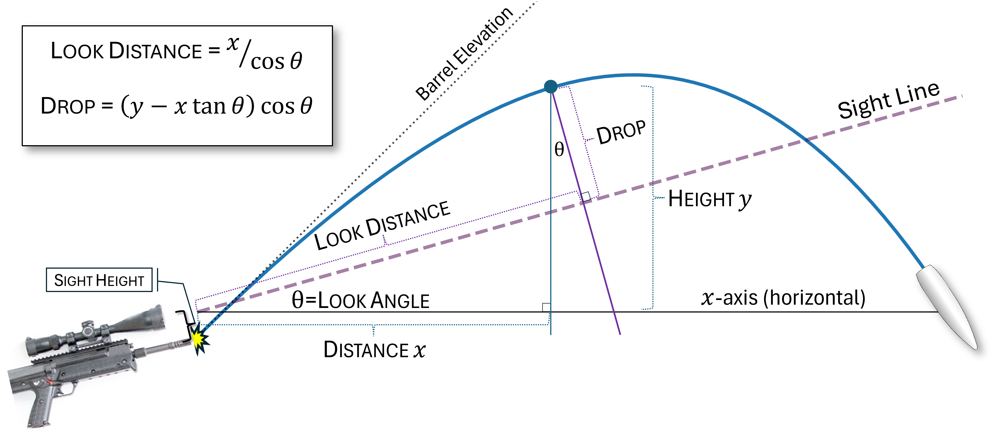

# BallisticCalculator
LGPL library for small arms ballistic calculations (Python 3.9+)

# Installation
```python setup.py build_ext --inplace```

# Usage
[Example.ipynb](Example.ipynb) illustrates all features and usage.

# Concepts

## Look angle
*Look angle* is the elevation of the sight line (a.k.a., _Line of Sight_, or _LoS_) relative to the horizon.  For flat fire at angles close to horizontal this does not make a significant difference.  When the look angle is significantly above or below the horizon the trajectory will be different because:

1. Gravity is not orthogonal to the velocity
2. Air density changes with altitude, so the drag effects will vary across an arcing trajectory.

The shooter typically cares about the line of sight (LoS): Sight adjustments (_drop_ in the following figure) are made relative to LoS, and ranging errors – and hence danger space – follow the line of sight, not the horizon.

The following diagram shows how _look distance_ and _drop_ relate by _look angle_ to the (distance _x_, height _y_) data produced by the calculator.


## Danger Space


# Sources
3 Degree-of-Freedom (3DOF+) + spin-drift ballistic calculator.  This version refactored, corrected, and enhanced by David Bookstaber
from [version ported to Cython by o-murphy](https://github.com/o-murphy/py-ballisticcalc), from [versions by Nikolay Gekht](https://github.com/gehtsoft-usa/BallisticCalculator1) with [Go documentation](https://godoc.org/github.com/gehtsoft-usa/go_ballisticcalc) and [C# documentation](https://gehtsoft-usa.github.io/BallisticCalculator/web-content.html), that draw from [JBM's code](https://jbmballistics.com/ballistics/downloads/downloads.shtml).