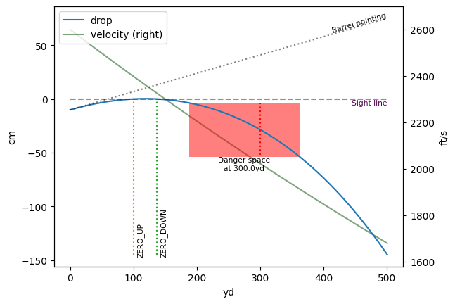
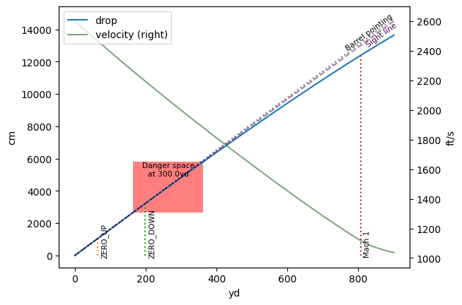

# BallisticCalculator
LGPL library for small arms ballistic calculations (Python 3.9+)

### Table of contents
* **[Installation](#installation)**
  * [Latest stable](#latest-stable-release-from-pypi)
  * [From sources](#installing-from-sources)
  * [Clone and build](#clone-and-build)
* **[Usage](#usage)**
  * **[Jupyter notebook](#jupyter-notebook)**
  * [Units of measure](#unit-manipulation-syntax)
  * [An example of calculations](#an-example-of-calculations)
  * [Output example](#example-of-the-formatted-output)
* **[Older versions]()**
  * [v1.0.x](https://github.com/o-murphy/py_ballisticcalc/tree/v1.0.12)
* **[Contributors](#contributors)**
* **[Sister projects](#sister-projects)**
* **[About project](#about-project)**

### Installation
#### Latest stable release from pypi**
```shell
pip install py-ballisticcalc

# Using precompiled backend (improves performance)
pip install py-ballisticcalc[exts]

# Using matplotlib and pandas uses additional dependencies
pip install py-ballisticcalc[charts]
```


#### Using matplotlib and pandas uses additional dependencies
```shell
pip install py-ballisticcalc[charts]
```


[//]: # (#### Installing from sources)

[//]: # (**MSVC** or **GCC** required)

[//]: # (* Download and install **MSVC** or **GCC** depending on target platform)

[//]: # (* Use one of the references you need:)

[//]: # (```shell)

[//]: # (# no binary from PyPi)

[//]: # (pip install py-ballisticcalc==<version> --no-binary py-ballisticcalc)

[//]: # ()
[//]: # (# master brunch)

[//]: # (pip install git+https://github.com/o-murphy/py_ballisticcalc)

[//]: # ()
[//]: # (# specific branch)

[//]: # (pip install git+https://github.com/o-murphy/py_ballisticcalc.git@<target_branch_name>)

[//]: # (```)

[//]: # (#### Clone and build)

[//]: # (**MSVC** or **GCC** required)

[//]: # (```shell)

[//]: # (git clone https://github.com/o-murphy/py_ballisticcalc)

[//]: # (cd py_ballisticcalc)

[//]: # (python -m venv venv)

[//]: # (. venv/bin/activate)

[//]: # (pip install cython)

[//]: # (python setup.py build_ext --inplace)

[//]: # (```)

## Usage

#### Jupyter notebook

```python
# Uncomment pyximport to compile instead of running pure python
#import pyximport; pyximport.install(language_level=3)

from matplotlib import pyplot as plt
from py_ballisticcalc import Velocity, Distance, Angular
from py_ballisticcalc import DragModel, TableG7
from py_ballisticcalc import Ammo
from py_ballisticcalc import Weapon, Shot, Calculator
from py_ballisticcalc import Settings as Set
```

```python
# Define standard .308
dm = DragModel(0.22, TableG7, 168, 0.308)
ammo = Ammo(dm, 1.22, Velocity(2600, Velocity.FPS))

# Establish 100-yard zero
weapon = Weapon(4, 100, 12, Angular.Mil(0))
calc = Calculator(weapon, ammo)
zero_elevation = calc.elevation
print(f'Barrel elevation for zero: {zero_elevation << Angular.MOA}')
```

    Barrel elevation for zero: 6.41MOA
    


```python
# Plot trajectory out to 500 yards
shot = Shot(500, zero_angle=calc.elevation, relative_angle=Angular.Mil(0))
shot_result = calc.fire(shot, 0, extra_data=True)
ax = shot_result.plot()
# Find danger space for a half-meter tall target at 300 yards
danger_space = shot_result.danger_space(
    Distance.Yard(300), Distance.Meter(.5), Angular.Mil(0)
)
print(danger_space)
# Highlight danger space on the plot
danger_space.overlay(ax)
plt.show()
```

    ext True
    Danger space at 300.0yd for 50.0cm tall target ranges from 187.533yd to 361.7yd
    


    

    


```python
# Now find the elevation needed to hit a target at 200 yards with 10-degree look angle
weapon = Weapon(4, 200, 12, Angular.Degree(10))
calc = Calculator(weapon, ammo)
zero_elevation = calc.elevation
print(f'To hit target at {weapon.zero_distance << Set.Units.distance} sighted at a ' 
      f'{weapon.zero_look_angle << Angular.Degree} look angle, Barrel elevation={zero_elevation << Angular.Degree}')
```

    To hit target at 200.0yd sighted at a 10.0° look angle, Barrel elevation=10.1224°
    


```python
shot = Shot(900, zero_angle=calc.elevation)
shot_result = calc.fire(shot, 0, extra_data=True)
ax = shot_result.plot()
# Find danger space for a target at 500 yards
danger_space = shot_result.danger_space(
    Distance.Yard(300), Distance.Meter(.5), calc.weapon.zero_look_angle
)
print(danger_space)
# Highlight danger space on the plot
danger_space.overlay(ax)
plt.show()
```

    ext True
    Danger space at 300.0yd for 50.0cm tall target ranges from 164.667yd to 362.433yd
    


    

    


```python
shot_result.dataframe.to_clipboard()
```


The library supports all the popular units of measurement, and adds different built-in methods to define and manipulate it
#### Unit manipulation syntax:

```python
from py_ballisticcalc.unit import *

# ways to define value in units
# 1. old syntax
unit_in_meter = Distance(100, Distance.Meter)
# 2. short syntax by Unit type class
unit_in_meter = Distance.Meter(100)
# 3. by Unit enum class
unit_in_meter = Unit.METER(100)

# >>> <Distance>: 100.0 m (3937.0078740157483)

# convert unit
# 1. by method
unit_in_yard = unit_in_meter.convert(Distance.Yard)
# 2. using shift syntax
unit_in_yards = unit_in_meter << Distance.Yard  # '<<=' operator also supports
# >>> <Distance>: 109.36132983377078 yd (3937.0078740157483)

# get value in specified units
# 1. by method
value_in_km = unit_in_yards.get_in(Distance.Kilometer)
# 2. by shift syntax
value_in_km = unit_in_yards >> Distance.Kilometer  # '>>=' operator also supports
# >>> 0.1

# getting unit raw value:
rvalue = Distance.Meter(10).raw_value
rvalue = float(Distance.Meter(10))

# units comparison:
# supports operators like < > <= >= == !=
Distance.Meter(100) == Distance.Centimeter(100)  # >>> False, compare two units by raw value
Distance.Meter(100) > 10  # >>> True, compare unit with float by raw value
```

#### An example of calculations

```python
from py_ballisticcalc import Velocity, Temperature, Distance
from py_ballisticcalc import DragModel, TableG7
from py_ballisticcalc import Ammo, Atmo, Wind
from py_ballisticcalc import Weapon, Shot, Calculator
from py_ballisticcalc import Settings as Set


# set global library settings
Set.Units.velocity = Velocity.FPS
Set.Units.temperature = Temperature.Celsius
# Set.Units.distance = Distance.Meter
Set.Units.sight_height = Distance.Centimeter

Set.set_max_calc_step_size(Distance.Foot(1))
Set.USE_POWDER_SENSITIVITY = True  # enable muzzle velocity correction my powder temperature

# define params with default units
weight, diameter = 168, 0.308
# or define with specified units
length = Distance.Inch(1.282)  # length = Distance(1.282, Distance.Inch)

weapon = Weapon(9, 100, 2)
dm = DragModel(0.223, TableG7, weight, diameter)

ammo = Ammo(dm, length, 2750, 15)
ammo.calc_powder_sens(2723, 0)

zero_atmo = Atmo.icao(100)

# defining calculator instance
calc = Calculator(weapon, ammo, zero_atmo)

current_atmo = Atmo(110, 1000, 15, 72)
current_winds = [Wind(2, 90)]
shot = Shot(1500, atmo=current_atmo, winds=current_winds)

shot_result = calc.fire(shot, trajectory_step=Distance.Yard(100))

for p in shot_result:
    print(p.formatted())
```
#### Example of the formatted output:
```shell
python -m py_ballisticcalc.example
```

```
['0.00 s', '0.000 m', '2750.0 ft/s', '2.46 mach', '-9.000 cm', '0.00 mil', '0.000 cm', '0.00 mil', '3825 J']
['0.12 s', '100.000 m', '2528.6 ft/s', '2.26 mach', '0.005 cm', '0.00 mil', '-3.556 cm', '-0.36 mil', '3233 J']
['0.26 s', '200.050 m', '2317.2 ft/s', '2.08 mach', '-7.558 cm', '-0.38 mil', '-13.602 cm', '-0.69 mil', '2715 J']
['0.41 s', '300.050 m', '2116.6 ft/s', '1.90 mach', '-34.843 cm', '-1.18 mil', '-30.956 cm', '-1.05 mil', '2266 J']
['0.57 s', '400.000 m', '1926.5 ft/s', '1.73 mach', '-85.739 cm', '-2.18 mil', '-57.098 cm', '-1.45 mil', '1877 J']
['0.75 s', '500.000 m', '1745.0 ft/s', '1.56 mach', '-165.209 cm', '-3.37 mil', '-94.112 cm', '-1.92 mil', '1540 J']
['0.95 s', '600.000 m', '1571.4 ft/s', '1.41 mach', '-279.503 cm', '-4.74 mil', '-144.759 cm', '-2.46 mil', '1249 J']
```

## Contributors
### This project exists thanks to all the people who contribute.
<a href="https://github.com/o-murphy/py_ballisticcalc/graphs/contributors"></a>
#### Special thanks to:
- **[David Bookstaber](https://github.com/dbookstaber)** - Ballistics Expert, Financial Engineer \
*For the help in understanding and improvement of some calculation methods*
- **[Nikolay Gekht](https://github.com/nikolaygekht)** \
*For the sources code on C# and GO-lang from which this project firstly was forked from*

## Sister projects

### [Py-BalCalc](https://github.com/o-murphy/py-balcalc) and [eBallistica](https://github.com/o-murphy/py-balcalc)
* **Py-BalCalc** - GUI App for [py_ballisticcalc](https://github.com/o-murphy/py_ballisticcalc) solver library and profiles editor
* **eBallistica** - Kivy based mobile App for ballistic calculations

###  [ArcherBC2](https://github.com/JAremko/ArcherBC2) and [ArcherBC2 mobile](https://github.com/ApodemusSylvaticus/archerBC2_mobile)
* **ArcherBC2** and **ArcherBC2 mobile** - Ballistic profiles editors
  - *Also, checkout [a7p_transfer_example](https://github.com/JAremko/a7p_transfer_example) or [a7p](https://github.com/o-murphy/a7p) repo to get info about ballistic profiles format*


## About project

The library provides trajectory calculation for projectiles including for various
applications, including air rifles, bows, firearms, artillery and so on.

3DF model that is used in this calculator is rooted in old C sources of version 2 of the public version of JBM
calculator, ported to C#, optimized, fixed and extended with elements described in
Litz's "Applied Ballistics" book and from the friendly project of Alexandre Trofimov
and then ported to Go.

Now it's also ported to python3 and expanded to support calculation trajectory by 
multiple ballistics coefficients and using custom drag data (such as Doppler radar data ©Lapua, etc.)

**[The online version of Go documentation is located here](https://godoc.org/github.com/gehtsoft-usa/go_ballisticcalc)**

**[C# version of the package is located here](https://github.com/gehtsoft-usa/BallisticCalculator1)**

**[The online version of C# API documentation is located here](https://gehtsoft-usa.github.io/BallisticCalculator/web-content.html)**

Go documentation can be obtained using godoc tool.

The current status of the project is ALPHA version.

#### RISK NOTICE

The library performs very limited simulation of a complex physical process and so it performs a lot of approximations. Therefore, the calculation results MUST NOT be considered as completely and reliably reflecting actual behavior or characteristics of projectiles. While these results may be used for educational purpose, they must NOT be considered as reliable for the areas where incorrect calculation may cause making a wrong decision, financial harm, or can put a human life at risk.

THE CODE IS PROVIDED "AS IS", WITHOUT WARRANTY OF ANY KIND, EXPRESS OR IMPLIED, INCLUDING BUT NOT LIMITED TO THE WARRANTIES OF MERCHANTABILITY, FITNESS FOR A PARTICULAR PURPOSE AND NONINFRINGEMENT. IN NO EVENT SHALL THE AUTHORS OR COPYRIGHT HOLDERS BE LIABLE FOR ANY CLAIM, DAMAGES OR OTHER LIABILITY, WHETHER IN AN ACTION OF CONTRACT, TORT OR OTHERWISE, ARISING FROM, OUT OF OR IN CONNECTION WITH THE MATERIALS OR THE USE OR OTHER DEALINGS IN THE MATERIALS.
