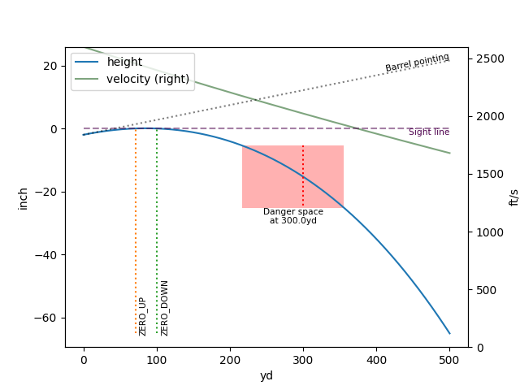

# BallisticCalculator
LGPL library for small arms ballistic calculations based on point-mass (3 DoF) plus spin drift.


[![license]][LGPL-3]
[![pypi]][PyPiUrl]
[![downloads]][pepy]
[![downloads/month]][pepy]
[![versions]][sources]
[![Made in Ukraine]][SWUBadge]


[sources]:
https://github.com/o-murphy/py-ballisticcalc
[license]:
https://img.shields.io/github/license/o-murphy/py-ballisticcalc?style=flat-square
[LGPL-3]:
https://opensource.org/licenses/LGPL-3.0-only
[pypi]:
https://img.shields.io/pypi/v/py-ballisticcalc?style=flat-square&logo=pypi
[PyPiUrl]:
https://pypi.org/project/py-ballisticcalc/
[downloads]:
https://img.shields.io/pepy/dt/py-ballisticcalc?style=flat-square
[downloads/month]:
https://static.pepy.tech/personalized-badge/py-ballisticcalc?style=flat-square&period=month&units=abbreviation&left_color=grey&right_color=blue&left_text=downloads%2Fmonth
[pepy]:
https://pepy.tech/project/py-ballisticcalc
[versions]:
https://img.shields.io/pypi/pyversions/py-ballisticcalc?style=flat-square
[Made in Ukraine]:
https://img.shields.io/badge/made_in-Ukraine-ffd700.svg?labelColor=0057b7&style=flat-square
[SWUBadge]:
https://stand-with-ukraine.pp.ua

### Table of contents
* **[Installation](#installation)**
  * [Latest stable](#latest-stable-release-from-pypi)

  [//]: # (    * [From sources]&#40;#installing-from-sources&#41;)
  [//]: # (  * [Clone and build]&#40;#clone-and-build&#41;)

* **[Usage](#usage)**
  * [Simple example](#simple-zero)
  * [Plot trajectory](#plot-trajectory-with-danger-space)
  * [Range card](#plot-trajectory-with-danger-space)
  * [Complex example](#complex-example)
  * [Jupyter notebook](Example.ipynb)
  * [Preferences](#preferences)
  * [Units of measure](#units)

  [//]: # (  * [An example of calculations]&#40;#an-example-of-calculations&#41;)
  [//]: # (  * [Output example]&#40;#example-of-the-formatted-output&#41;)
* **[Concepts](#concepts)**
* **[Older versions]()**
  * [v1.1.x](https://github.com/o-murphy/py_ballisticcalc/tree/v1.1.4)
  * [v1.0.x](https://github.com/o-murphy/py_ballisticcalc/tree/v1.0.12)
* **[Contributors](#contributors)**
* **[About project](#about-project)**

# Installation

[//]: # (```python setup.py build_ext --inplace```)

[//]: # (## Latest stable release from pypi)
```shell
pip install py-ballisticcalc

# Using precompiled backend (improves performance)
pip install py-ballisticcalc[exts]

# Using matplotlib and pandas uses additional dependencies
pip install py-ballisticcalc[charts]
```

# Usage
**See [Example.ipynb](Example.ipynb) for detailed illustrations of all features and usage.**

```python
# Uncomment pyximport to compile instead of running pure python
#import pyximport; pyximport.install(language_level=3)

from py_ballisticcalc import *
```

## Simple Zero
```python
# Establish 100-yard zero for a standard .308, G7 bc=0.22, muzzle velocity 2600fps
zero = Shot(weapon=Weapon(sight_height=2), ammo=Ammo(DragModel(0.22, TableG7), mv=Velocity.FPS(2600)))
calc = Calculator()
zero_distance = Distance.Yard(100)
zero_elevation = calc.set_weapon_zero(zero, zero_distance)
print(f'Barrel elevation for {zero_distance} zero: {zero_elevation << PreferredUnits.adjustment}')
```

    Barrel elevation for 100.0yd zero: 1.33mil

## Plot Trajectory with Danger Space
```python
# Plot trajectory out to 500 yards
shot_result = calc.fire(zero, trajectory_range=500, extra_data=True)
ax = shot_result.plot()
# Find danger space for a half-meter tall target at 300 yards
danger_space = shot_result.danger_space(Distance.Yard(300), Distance.Meter(.5))
print(danger_space)
danger_space.overlay(ax)  # Highlight danger space on the plot
plt.show()
```

    Danger space at 300.0yd for 19.7inch tall target ranges from 217.1yd to 355.7yd



## Print Range Card
```python
# Range card for this zero with 5mph cross-wind from left to right
zero.winds = [Wind(Velocity.MPH(5), Angular.OClock(3))]
range_card = calc.fire(zero, trajectory_range=1000)
range_card.dataframe().to_clipboard()
range_card.dataframe(True)[['distance', 'velocity', 'mach', 'time', 'target_drop', 'drop_adj', 'windage', 'windage_adj']].set_index('distance')
```

| distance | velocity | mach | time | target_drop | drop_adj | windage | windage_adj |
| -------- | -------- | ---- | ---- | ----------- | -------- | ------- | ----------- |
| 0.0 yd | 2600.0 ft/s | 2.33 mach | 0.000 s | -2.0 inch | 0.00 mil | -0.0 inch | 0.00 mil |
| 100.0 yd | 2398.1 ft/s | 2.15 mach | 0.120 s | -0.0 inch | -0.00 mil | 0.4 inch | 0.12 mil |
| 200.0 yd | 2205.5 ft/s | 1.98 mach | 0.251 s | -4.1 inch | -0.57 mil | 1.7 inch | 0.25 mil |
| 300.0 yd | 2022.3 ft/s | 1.81 mach | 0.393 s | -15.3 inch | -1.44 mil | 4.1 inch | 0.39 mil |
| 400.0 yd | 1847.5 ft/s | 1.65 mach | 0.548 s | -35.0 inch | -2.48 mil | 7.6 inch | 0.54 mil |
| 500.0 yd | 1680.1 ft/s | 1.50 mach | 0.718 s | -65.0 inch | -3.68 mil | 12.4 inch | 0.70 mil |
| 600.0 yd | 1519.5 ft/s | 1.36 mach | 0.906 s | -107.3 inch | -5.06 mil | 18.8 inch | 0.89 mil |
| 700.0 yd | 1366.0 ft/s | 1.22 mach | 1.114 s | -164.8 inch | -6.66 mil | 27.0 inch | 1.09 mil |
| 800.0 yd | 1221.3 ft/s | 1.09 mach | 1.347 s | -240.9 inch | -8.52 mil | 37.3 inch | 1.32 mil |
| 900.0 yd | 1093.2 ft/s | 0.98 mach | 1.607 s | -340.5 inch | -10.71 mil | 50.0 inch | 1.57 mil |
| 1000.0 yd | 1029.8 ft/s | 0.92 mach | 1.891 s | -469.0 inch | -13.27 mil | 64.8 inch | 1.83 mil |

## Complex Example

Here we define a standard .50BMG, enable powder temperature sensitivity, and zero for a distance of 500 meters, in a 5°C atmosphere at altitude 1000ft ASL.

```python
dm = DragModel(0.62, TableG1, 661, 0.51, 2.3)
ammo=Ammo(dm, Velocity.MPS(850), Temperature.Celsius(15), use_powder_sens=True)
ammo.calc_powder_sens(Velocity.MPS(820), Temperature.Celsius(0))
weapon = Weapon(sight_height=Distance.Centimeter(9), twist=15)
atmo = Atmo(altitude=Distance.Foot(1000), temperature=Unit.Celsius(5), humidity=.5)
zero = Shot(weapon=weapon, ammo=ammo, atmo=atmo)
zero_distance = Distance.Meter(500)
calc = Calculator()
zero_elevation = calc.set_weapon_zero(zero, zero_distance)
print(f'Barrel elevation for {zero_distance} zero: {zero_elevation << PreferredUnits.adjustment}')
print(f'Muzzle velocity at zero temperature {atmo.temperature} is {ammo.get_velocity_for_temp(atmo.temperature) << Velocity.MPS}')
```

    Barrel elevation for 500.0m zero: 4.69mil
    Muzzle velocity at zero temperature 5.0°C is 830.0m/s

## Preferences
In version 2.x.x we changed concepts of settings, there are 2 ways to set preferences

#### 1. To change library default units directly from code use `PreferredUnits` object

```python
from py_ballisticcalc import PreferredUnits, Velocity, Angular, Temperature, Distance

# Change default library units
PreferredUnits.velocity = Velocity.MPS
PreferredUnits.adjustment = Angular.Mil
PreferredUnits.temperature = Temperature.Celsius
PreferredUnits.distance = Distance.Meter
PreferredUnits.sight_height = Distance.Centimeter
PreferredUnits.drop = Distance.Centimeter

print(f'PreferredUnits: {str(PreferredUnits)}')
print(f'Default distance unit: {PreferredUnits.distance.name}')

# Can create value in default unit with either float or another unit of same type
print(f'\tInstantiated from float (5): {PreferredUnits.distance(5)}')
print(f'\tInstantiated from Distance.Line(200): {PreferredUnits.distance(Distance.Line(200))}')
```

#### 2. To change solver global setting use global flags setters
> [!IMPORTANT]
> This way is deprecated and will be removed in a future version, use [InterfaceConfigDict](#3-to-change-solver-interface-setting-use-_config-attribute-for-calculator)
> _globalUsePowderSensitivity no more supports, use Ammo.use_powder_sens instead and Atmo.powder_t
```python
from py_ballisticcalc import *

set_global_max_calc_step_size(Unit.Meter(1))
step = get_global_max_calc_step_size()

# reset global flags to defaults
reset_globals()
```

#### 3. To change solver interface setting use _config attribute for Calculator
```python
from py_ballisticcalc import Calculator, InterfaceConfigDict
config = InterfaceConfigDict(
    max_calc_step_size_feet=1.,
  # cZeroFindingAccuracy= ...,
    cMinimumVelocity= 0,
  # cMaximumDrop= ...,
  # cMaxIterations= ...,
  # cGravityConstant= ...,
  # cMinimumAltitude= ...,
)
calc = Calculator(_config=config)
```

## Units
#### Use new method to set preferred units/settings globally for the venv or the user
Create `.pybc.toml` or `pybc.toml` file in your project root directory _(where venv was placed)_.
Or place this file in user's home directory. _(The file in project root have priority.)_
Use `loadMetricUnits()`, `loadImperialUnits()` or `loadMixedUnits()` to manualy load one of preinstalled pressets.
You can use `basicConfig()` function to load your custom `.toml` file

The references of `.pybc.toml` settings file you can [**get there**](https://github.com/o-murphy/py-ballisticcalc/blob/master/.pybc.toml)
and [**there**](https://github.com/o-murphy/py-ballisticcalc/tree/master/py_ballisticcalc/assets). They include settings for [metric]
(https://github.com/o-murphy/py-ballisticcalc/tree/master/py_ballisticcalc/assets/.pybc-metrics.toml), [imperial](https://github.com/o-murphy/py-ballisticcalc/tree/master/py_ballisticcalc/assets/.pybc-imperial.toml) and 
[mixed](https://github.com/o-murphy/py-ballisticcalc/tree/master/py_ballisticcalc/assets/.pybc-mixed.toml) mode. 
Mixed mode is using metric settings for angular, distance, velocity, pressure, and temperature units, and imperial for diameter,
length, weight and adjustment units.

```toml
# Config template for py_ballisticcalc

title = "standard py_ballisticcalc config template"
version = "2.0.0b4"

[pybc.preferred_units]
angular = 'Degree'
distance = 'Yard'
velocity = 'FPS'
# ... other there

[pybc.calculator]
max_calc_step_size = { value = 0.5, units = "Foot" }
# ...
```

##### Load .pybc.toml presets
```python
from py_ballisticcalc import loadImperialUnits, loadMetricUnits, loadMixedUnits

loadImperialUnits()
loadMetricUnits()
loadMixedUnits()
```
(Use just one of these three methods - only the last one called counts).

##### Custom .pybc.toml
```python
from py_ballisticcalc import basicConfig

basicConfig("path/to/your_config.toml")
```

#### Available manipulations with units
```python
from py_ballisticcalc.unit import *

# Ways to define value in units
# 1. old syntax
unit_in_meter = Distance(100, Distance.Meter)
# 2. short syntax by Unit type class
unit_in_meter = Distance.Meter(100)
# 3. by Unit enum class
unit_in_meter = Unit.Meter(100)
print(f'100 meters: {unit_in_meter}')
# >>> 100 meters: 100.0m

# Convert unit
# 1. by .convert()
unit_in_yards = unit_in_meter.convert(Distance.Yard)
# 2. using shift syntax
unit_in_yards = unit_in_meter << Distance.Yard  # '<<=' operator also supports
print(f'100 meters in {unit_in_yards.units.key}: {unit_in_yards}')
# >>> 100 meters in yard: 109.4yd

# Get value in specified units (as float)
# 1. by .get_in()
value_in_km = unit_in_yards.get_in(Distance.Kilometer)
# 2. by shift syntax
value_in_km = unit_in_yards >> Distance.Kilometer  # '>>=' operator also supports
print(f'100 meters, value in km: {value_in_km}  (value type is {type(value_in_km)})')
# >>> 100 meters, value in km: 0.1  (value type is <class 'float'>)

# Getting unit raw value (a float)
rvalue = Distance.Meter(100).raw_value
rvalue = float(Distance.Meter(100))
print(f'100 meters in raw value: {rvalue}  (raw type is {type(rvalue)})')
# >>> 100 meters in raw value: 3937.0078740157483  (raw type is <class 'float'>)

# Comparison operators supported: < > <= >= == !=
print(f'Comparison: {unit_in_meter} == {Distance.Centimeter(100)}: {unit_in_meter == Distance.Centimeter(100)}')
# >>> False, compare two units by raw value
print(f'Comparison: {unit_in_meter} > .1*{unit_in_meter}: {unit_in_meter > .1*unit_in_meter.raw_value}')
# >>> True, compare unit with float by raw value
```

# Concepts

## Look angle
*Look angle* is the elevation of the sight line (a.k.a., _Line of Sight_, or _LoS_) relative to the horizon.  For flat fire at angles close to horizontal this does not make a significant difference.  When the look angle is significantly above or below the horizon the trajectory will be different because:

1. Gravity is not orthogonal to the velocity
2. Air density changes with altitude, so the drag effects will vary across an arcing trajectory.

The shooter typically cares about the line of sight (LoS): Sight adjustments (_drop_ in the following figure) are made relative to LoS, and ranging errors – and hence [danger space](#danger-space) – follow the line of sight, not the horizon.

The following diagram shows how _look distance_ and _drop_ relate by _look angle_ to the underlying (distance _x_, height _y_) trajectory data.


## Danger Space
Danger space is a practical measure of sensitivity to ranging error.  It is defined for a target of height *h* and distance *d*, and it indicates how far forward and backward along the line of sight the target can move such that the trajectory will still hit somewhere (vertically) on the target.


# About project

The library provides trajectory calculation for ballistic projectiles including air rifles, bows, firearms, artillery, and so on.

The 3DoF model that is used in this calculator is rooted in public C code of [JBM's calculator](https://jbmballistics.com/ballistics/calculators/calculators.shtml), ported to C#, optimized, fixed and extended with elements described in Litz's _Applied Ballistics_ book and from the friendly project of Alexandre Trofimov and then ported to Go.

This Python3 implementation has been expanded to support multiple ballistic coefficients and custom drag functions, such as those derived from Doppler radar data.

**[The online version of Go documentation is located here](https://godoc.org/github.com/gehtsoft-usa/go_ballisticcalc)**.

**[C# version of the package is located here](https://github.com/gehtsoft-usa/BallisticCalculator1), and [the online version of C# API documentation is located here](https://gehtsoft-usa.github.io/BallisticCalculator/web-content.html)**.

## Contributors
**This project exists thanks to all the people who contribute.**

<a href="https://github.com/o-murphy/py_ballisticcalc/graphs/contributors"></a>

Special thanks to:
- **[David Bookstaber](https://github.com/dbookstaber)** - Ballistics Expert\
*For help understanding and improving the functionality*
- **[Nikolay Gekht](https://github.com/nikolaygekht)** \
*For the sources code on C# and GO-lang from which this project firstly was forked*

[//]: # (## Sister projects)

[//]: # ()
[//]: # (* **Py-BalCalc** - GUI App for [py_ballisticcalc]&#40;https://github.com/o-murphy/py_ballisticcalc&#41; solver library and profiles editor)

[//]: # (* **eBallistica** - Kivy based mobile App for ballistic calculations)

[//]: # ()
[//]: # (*  [ArcherBC2]&#40;https://github.com/JAremko/ArcherBC2&#41; and [ArcherBC2 mobile]&#40;https://github.com/ApodemusSylvaticus/archerBC2_mobile&#41; - Ballistic profile editors)

[//]: # (  - *See also [a7p_transfer_example]&#40;https://github.com/JAremko/a7p_transfer_example&#41; or [a7p]&#40;https://github.com/o-murphy/a7p&#41; repo to get info about the ballistic profile format*)

## RISK NOTICE

The library performs very limited simulation of a complex physical process and so it performs a lot of approximations. Therefore, the calculation results MUST NOT be considered as completely and reliably reflecting actual behavior or characteristics of projectiles. While these results may be used for educational purpose, they must NOT be considered as reliable for the areas where incorrect calculation may cause making a wrong decision, financial harm, or can put a human life at risk.

THE CODE IS PROVIDED "AS IS", WITHOUT WARRANTY OF ANY KIND, EXPRESS OR IMPLIED, INCLUDING BUT NOT LIMITED TO THE WARRANTIES OF MERCHANTABILITY, FITNESS FOR A PARTICULAR PURPOSE AND NONINFRINGEMENT. IN NO EVENT SHALL THE AUTHORS OR COPYRIGHT HOLDERS BE LIABLE FOR ANY CLAIM, DAMAGES OR OTHER LIABILITY, WHETHER IN AN ACTION OF CONTRACT, TORT OR OTHERWISE, ARISING FROM, OUT OF OR IN CONNECTION WITH THE MATERIALS OR THE USE OR OTHER DEALINGS IN THE MATERIALS.
