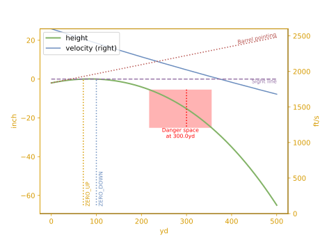
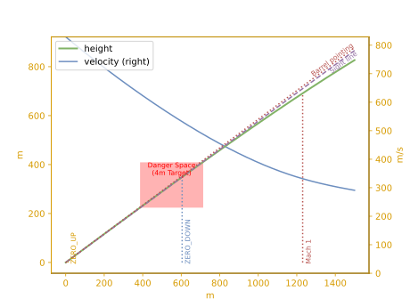

```python
# Uncomment pyximport to compile instead of running pure python
#import pyximport; pyximport.install(language_level=3)

from matplotlib import pyplot as plt
from py_ballisticcalc import Velocity, Distance, Angular
from py_ballisticcalc import DragModel, TableG7
from py_ballisticcalc import Ammo
from py_ballisticcalc import Weapon, Shot, Calculator
from py_ballisticcalc import Settings as Set
```

    WARNING:py_balcalc:Library running in pure python mode. For better performance install 'py_ballisticcalc.exts' package
    


```python
# Define standard .308
dm = DragModel(0.22, TableG7, 168, 0.308)
ammo = Ammo(dm, 1.22, Velocity(2600, Velocity.FPS))

# Establish 100-yard zero
weapon = Weapon(4, 100, 12, Angular.Mil(0))
calc = Calculator(weapon, ammo)
zero_elevation = calc.elevation
print(f'Barrel elevation for zero: {zero_elevation << Angular.MOA}')
```

    Barrel elevation for zero: 6.41MOA
    


```python
# Plot trajectory out to 500 yards
shot = Shot(500, zero_angle=calc.elevation, relative_angle=Angular.Mil(0))
shot_result = calc.fire(shot, 0, extra_data=True)
ax = shot_result.plot()
# Find danger space for a half-meter tall target at 300 yards
danger_space = shot_result.danger_space(
    Distance.Yard(300), Distance.Meter(.5), Angular.Mil(0)
)
print(danger_space)
# Highlight danger space on the plot
danger_space.overlay(ax)
plt.show()
```

    ext True
    Danger space at 300.0yd for 50.0cm tall target ranges from 187.533yd to 361.7yd
    


    

    


```python
# Now find the elevation needed to hit a target at 200 yards with 10-degree look angle
weapon = Weapon(4, 200, 12, Angular.Degree(10))
calc = Calculator(weapon, ammo)
zero_elevation = calc.elevation
print(f'To hit target at {weapon.zero_distance << PreferredUnits.distance} sighted at a ' 
      f'{weapon.zero_look_angle << Angular.Degree} look angle, Barrel elevation={zero_elevation << Angular.Degree}')
```

    To hit target at 200.0yd sighted at a 10.0° look angle, Barrel elevation=10.1224°
    


```python
shot = Shot(900, zero_angle=calc.elevation)
shot_result = calc.fire(shot, 0, extra_data=True)
ax = shot_result.plot()
# Find danger space for a target at 500 yards
danger_space = shot_result.danger_space(
    Distance.Yard(300), Distance.Meter(.5), calc.weapon.zero_look_angle
)
print(danger_space)
# Highlight danger space on the plot
danger_space.overlay(ax)
plt.show()
```

    ext True
    Danger space at 300.0yd for 50.0cm tall target ranges from 164.667yd to 362.433yd
    


    

    


```python
shot_result.dataframe.to_clipboard()
```
