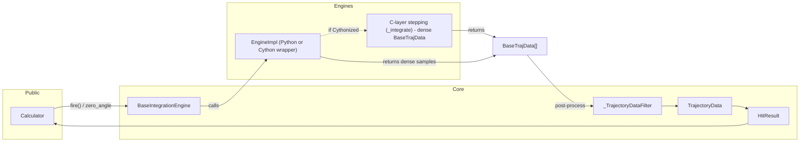
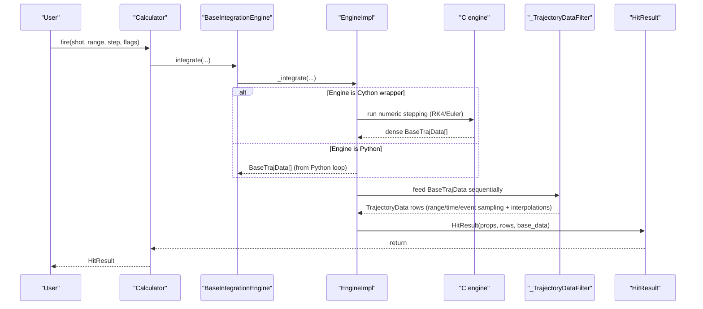
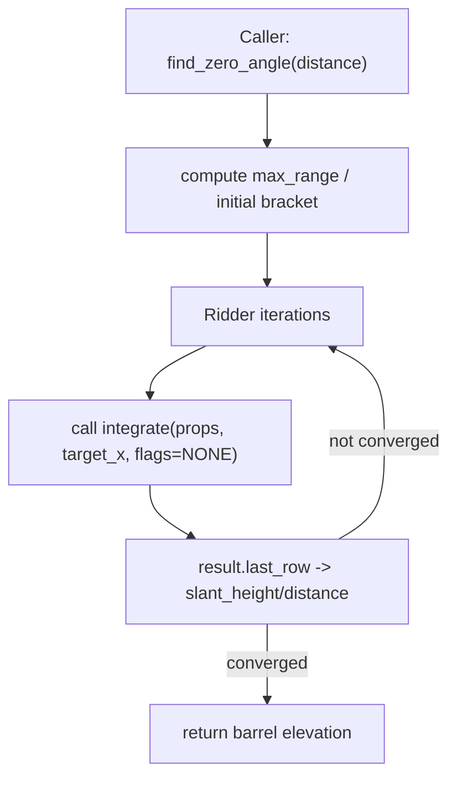

# Architecture Overview

This document orients you to the high-level structure and main components of the project so you can find where functionality is implemented.

**Goals**
- Keep a compact, well-tested ballistic calculator.
- Provide multiple integration engines (pure-Python and Cython-accelerated engines).
- Expose consistent APIs and event semantics (zero crossings, Mach crossing, apex) across engines.

## High-level layers

### 1. Public API
- `Calculator` (in `py_ballisticcalc/interface.py`) is the top-level helper used by most clients.
- Unit types and preferences are implemented in `py_ballisticcalc/unit.py` and `PreferredUnits`.

### 2. Scene / shot description
- `py_ballisticcalc.conditions.Shot` captures the shot parameters: `ammo`, `weapon`, `look_angle`, `relative_angle`, winds and atmosphere.
- `Ammo`, `Weapon`, and `Atmo` live in `py_ballisticcalc.munition` and `py_ballisticcalc.conditions`.

### 3. Drag model
- `py_ballisticcalc.drag_model` and `py_ballisticcalc.drag_tables` provide the drag lookup and interpolation used by the integrators.

### 4. Integration engines
- Engines implement `EngineProtocol` (see `py_ballisticcalc.generics.engine`).
- Python engines:
  - `py_ballisticcalc.engines.rk4.RK4IntegrationEngine`
  - `py_ballisticcalc.engines.euler` etc.
- Cython engines are compiled in `py_ballisticcalc.exts/py_ballisticcalc_exts` for performance:
  - `rk4_engine.pyx`, `euler_engine.pyx` implement high-performance numeric integration.
  
### 5. Trajectory data and events
- `py_ballisticcalc.trajectory_data` defines `BaseTrajData`, `TrajectoryData`, `TrajFlag`, `ShotProps`, and `HitResult`.
- Event flags include: ZERO_UP, ZERO_DOWN, MACH, RANGE, APEX, and they are recorded with union semantics when they occur within a small time window.
- `TrajectoryDataFilter` (in `engines/base_engine.py`) is the canonical Python implementation that:
  - Converts raw step samples to recorded `TrajectoryData` rows.
  - Handles sampling by range/time.
  - Detects events (zero crossings, Mach crossing, apex) and performs interpolation for precise event timestamps/values.
  - Applies unioning of flags within `BaseIntegrationEngine.SEPARATE_ROW_TIME_DELTA`.

#### Search helpers
- The engine provides root-finding and search helpers implemented on top of the integrate() method:
  - `zero_angle`, which falls back on the more computationally demanding but reliable `find_zero_angle`, finds barrel_elevation to hit a sight distance.
  - `find_max_range` finds angle that maximizes slant range.
  - `find_apex` finds the apex, which is where vertical velocity crosses from positive to negative.
- To ensure parity between engines, these searches run the same Python-side logic and temporarily relax termination constraints where needed.

#### Integration details & parity
- Cython engines return dense `BaseTrajData` samples; Python is responsible for event interpolation. This design keeps the high-level semantics in one place and reduces duplication.
- Engines use configuration parameters (`BaseEngineConfig`) such as `cMinimumVelocity`, `cMaximumDrop`, `cMinimumAltitude`, `cZeroFindingAccuracy`, and `cStepMultiplier` for step scaling.
- RK4: default internal time step = `DEFAULT_TIME_STEP * calc_step` (see `RK4IntegrationEngine.get_calc_step`).

#### Where to look when investigating bugs
- Event detection and interpolation: `py_ballisticcalc.engines.base_engine.TrajectoryDataFilter` and `py_ballisticcalc.trajectory_data`.
- Cython stepping: `py_ballisticcalc.exts/py_ballisticcalc_exts/*.pyx` (look for `_integrate` implementations).
- High-level search logic (zero/max_range/apex): `py_ballisticcalc.engines.base_engine` and mirrored logic in the Cython base wrapper `base_engine.pyx`.

#### Testing & examples
- Unit tests: `tests/` include fixtures and parity tests for the extensions.
- Notebooks: `examples/*.ipynb` provide extended examples and visualizations.

#### Performance note
- Prefer Cython RK4 engine for production runs when `py-ballisticcalc[exts]` is installed; the Cython modules focus on numeric inner loops and can be recompiled independently.

If you want deeper detail on any of these layers (e.g., a sequence diagram for firing or exact data shapes), let me know which area to expand.

## Diagrams

The following diagrams give a compact visual summary of the main runtime flows. They use Mermaid syntax which is supported by many documentation viewers (MkDocs with mermaid plugin, GitHub markdown preview with a mermaid extension, etc.).

### Component / Data-flow (high level)

### Runtime sequence (simplified)

### Zero-finding / search (overview)

The zero-finding methods are implemented on top of `integrate()`. The search loop repeatedly calls `integrate()` while adjusting barrel elevation; termination constraints (minimum velocity, max drop, min altitude) may be temporarily relaxed for robust bracketing.

Note: the search flow uses the same `integrate()` implementation that returns `HitResult`. For parity, both Python and Cython engines use the same search code; the Cython engine provides dense samples while Python orchestrates event detection and root-finding.
