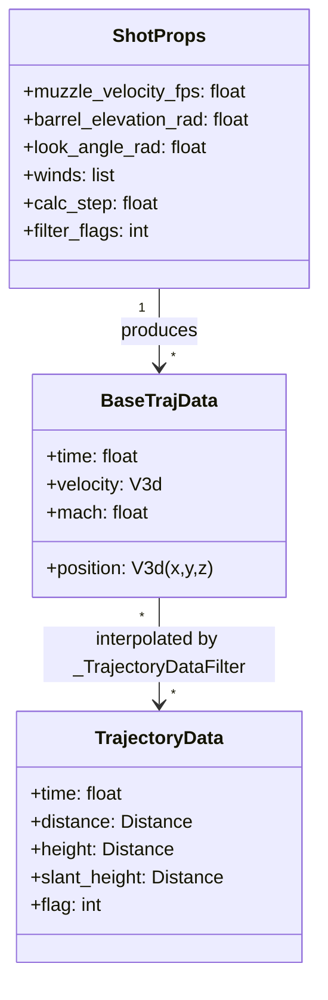
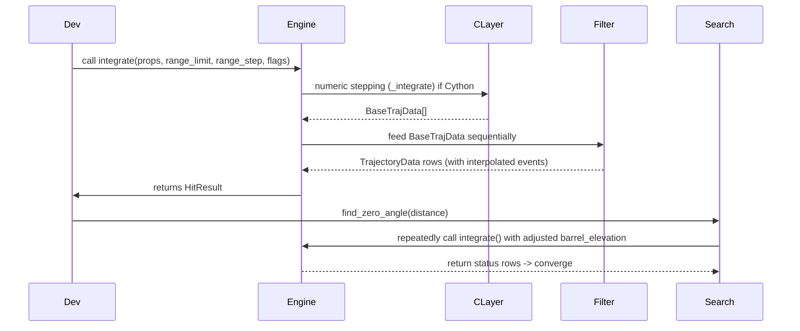
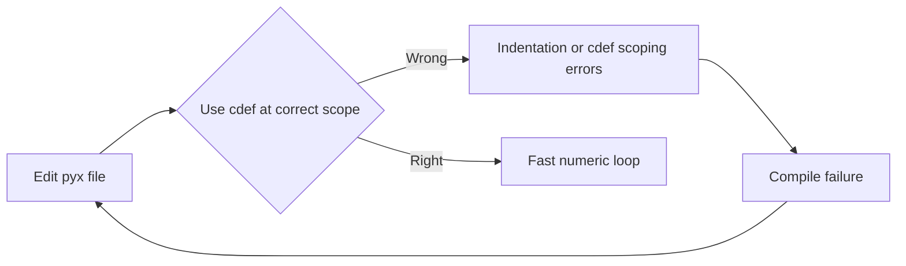

# Developer Details

This page is for contributors who want to modify algorithms, add engines, or extend the project.

## Recommended one-step dev setup (cross-platform)

```bash
# create/sync venv with dev + exts
uv sync --python 3.12 --dev --extra exts

# install editable local packages into the active venv
uv pip install -e ./py_ballisticcalc.exts
uv pip install -e .

# activate & test
source .venv/bin/activate   # Linux/macOS
# .\.venv\Scripts\activate  # Windows
python -m pytest tests --engine="rk4_engine"
```

Notes:
- The repo includes a `sitecustomize.py` that disables user site-packages and warns if you are not using the local `.venv`, to prevent stale/external packages from shadowing your build.
- VS Code settings and `.env` pin the interpreter to `.venv` and set `PYTHONNOUSERSITE=1` automatically.
 - If you prefer pip, using `python -m pip install -e ./py_ballisticcalc.exts` (then `python -m pip install -e .`) works fine when the venv is activated.

## CI and `uv.lock`
Development dependencies and reproducible developer/CI installs are pinned in `uv.lock`.
* This lockfile is for maintainers and CI reproducibility; it is not used by library consumers who install via pip/pyproject.
* If you use `uv` for environment management, run `uv sync --dev` (optionally with `--extra exts` to install the Cython subproject) to produce the locked environment used by CI.

## Code locations & responsibilities
- `py_ballisticcalc/` — core Python package.
  - `engines/` — Python engine implementations and `TrajectoryDataFilter`.
  - `trajectory_data.py` — `BaseTrajData`, `TrajectoryData`, `HitResult`, `TrajFlag`, interpolation helpers.
  - `conditions.py`, `munition.py` — shot and environment objects.
  - `drag_model.py`, `drag_tables.py` — drag lookup and interpolation.
- `py_ballisticcalc.exts/py_ballisticcalc_exts/` — Cython acceleration layer.
  - `base_engine.pyx` — Cython wrapper that orchestrates C-layer stepping and defers event logic to Python.
  - `rk4_engine.pyx`, `euler_engine.pyx` — numeric stepping implementations.
  - `cy_bindings.pyx/.pxd` — bridging helpers for C structs and helper functions.

## How engines are wired
- Public call flow (simplified):
  - `Calculator.fire()` calls `engine.integrate()`.
  - `BaseIntegrationEngine.integrate()` (Python) converts units, calls engine `_integrate()`.
  - Python `_integrate()` returns a `HitResult` constructed from `TrajectoryData` rows or (for Cythonized engines) dense `BaseTrajData` which are post-processed by Python `TrajectoryDataFilter`.

### Adding a new engine
1. Implement the `EngineProtocol` (or subclass `BaseIntegrationEngine`) and implement `_integrate(props, range_limit_ft, range_step_ft, time_step, filter_flags, dense_output)`.
2. If using Cython for performance, place numeric stepping in `py_ballisticcalc.exts/py_ballisticcalc_exts/*.pyx` and keep event detection in Python.
3. Add an entry point in `pyproject.toml` so `Calculator` can discover your engine.

## Testing & parity
- The project runs many parity tests that assert identical results between Python and Cython engines. When adding features, run the whole test suite using the `--engine="engine_name"` argument.
- Focus tests on:
  - Event parity (ZERO_UP/ZERO_DOWN/MACH/APEX) and interpolation accuracy.
  - Search functions (`find_zero_angle`, `find_max_range`, `find_apex`).
  - Dense output correctness (HitResult.base_data) and shape.

## [Cython notes](Cython.md) & common pitfalls
- Cython is used only for performance-critical numeric loops. Keep higher-level semantics in Python to avoid code duplication and subtle parity issues.
- Common Cython pitfalls observed in this codebase:
  - Indentation and cdef scoping errors — ensure `cdef` declarations live at the top of a C function or appropriate scope.
  - Avoid using Python booleans when declaring typed C variables (use `bint` and 0/1 assignment in the C context).
  - Keep initialisation of C structs and memory allocation clear; release resources in `_free_trajectory`.

## Debugging tips
- Reproduce failure with a focused pytest call (pass the test path) to avoid long runs.
- Add temporary debug prints in Python-side filter rather than in C to avoid recompiles.
- To iterate on Cython code rapidly: keep `pyx` edits small and incremental, run `py -m pip install -e .\py_ballisticcalc.exts` to rebuild the extension in-place.

## Build / test commands

```bash
# optional: install editable C extensions and main package
py -m pip install -e .\py_ballisticcalc.exts
py -m pip install -e .

# run a single test file
py -m pytest tests/test_exts_basic.py -q

# run full tests
py -m pytest -q
```

## Contribution checklist
- Keep parity: match Python reference implementations for event semantics unless you intentionally change behavior (document that change).
- Add tests for any public behavioral change.
- Keep Cython numeric code focused on inner loops and return dense samples for Python post-processing.

Where to ask questions
- Open an issue on the repository with a minimal reproduction and a note about the engine(s) involved.

Appendix: quick reference
- Key types: `BaseTrajData` (dense low-level samples), `TrajectoryData` (recorded rows with units), `ShotProps` (float-coded shot parameters), `HitResult` (result wrapper with `.trajectory`, `.base_data`, and `.flag()` helpers).

## Diagrams (developer view)

### Data shapes and contracts



### Developer sequence: integrate() -> filter -> search



### Common Cython pitfalls (visual)



These diagrams should help new contributors quickly understand how to trace behavior between the Python 'controller' code and the C/Cython numeric inner loop.
