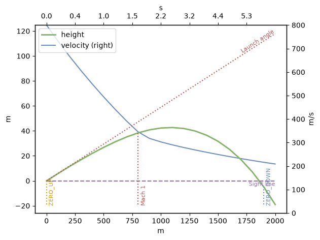
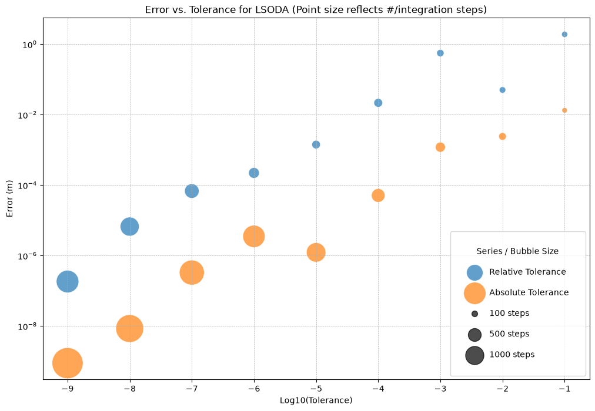
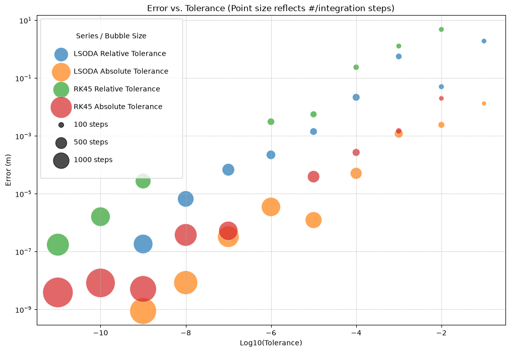
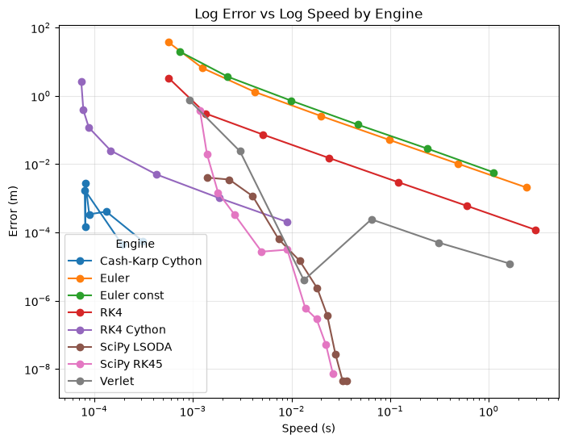

# Load


```python
import io
import logging
import math
import sys
import pandas as pd
from typing import Tuple, get_args
from py_ballisticcalc import Ammo, Atmo, Weapon, Shot, Calculator, HitResult
from py_ballisticcalc import RangeError, TrajFlag, BaseEngineConfigDict, SciPyEngineConfigDict
from py_ballisticcalc import TableG7, logger, loadMetricUnits
from py_ballisticcalc.drag_model import DragModel
from py_ballisticcalc.unit import *
from py_ballisticcalc.interface import _EngineLoader
logger.setLevel(logging.WARNING)
print("\nAvailable engines: " + str(sorted([e.name for e in _EngineLoader.iter_engines()])))
loadMetricUnits()
PreferredUnits.drop = Distance.Meter
PreferredUnits.distance = Distance.Meter
```

    
    Available engines: ['cythonized_rkck_engine', 'cythonized_euler_engine', 'cythonized_rk4_engine', 'cythonized_verlet_engine', 'euler_engine', 'rk4_engine', 'scipy_engine', 'verlet_engine']


## Reference Calculator

This _reference calculator_ will determine the "correct" trajectory against which the error of all others will be measured.


```python
ref_config = SciPyEngineConfigDict(
    relative_tolerance=1e-12,
    absolute_tolerance=1e-12,
    integration_method="LSODA",
)
ref_calc = Calculator(config=ref_config, engine='scipy_engine')
```

# Scenarios

## 2km flat-fire trajectory

A typical 7.62mm bullet launched at an elevation (60mils, about 3.375 degrees) sufficient to reach approximately 2km.  We use the reference calculator to compute the trajectory.


```python
dm = DragModel(0.22, TableG7, Weight.Gram(10), Distance.Centimeter(7.62), Distance.Centimeter(3.0))
ammo = Ammo(dm, Velocity.MPS(800))
weapon = Weapon(sight_height=Distance.Centimeter(4), twist=Distance.Centimeter(30), zero_elevation=Angular.Mil(60.0))
baseline_shot = Shot(weapon=weapon, ammo=ammo, atmo=Atmo.icao())
range = Distance.Meter(2000)
range_step = Distance.Meter(100)
reference_trajectory = ref_calc.fire(shot=baseline_shot, trajectory_range=range, trajectory_step=range_step, flags=TrajFlag.ALL)
reference_trajectory.plot()
ref = reference_trajectory.dataframe(True).drop(columns=['slant_height', 'drop_angle', 'windage', 'windage_angle', 'slant_distance', 'ogw'])
ref[ref.flag != "RANGE"]
```


<div>
<style scoped>
    .dataframe tbody tr th:only-of-type {
        vertical-align: middle;
    }

    .dataframe tbody tr th {
        vertical-align: top;
    }

    .dataframe thead th {
        text-align: right;
    }
</style>
<table border="1" class="dataframe">
  <thead>
    <tr style="text-align: right;">
      <th></th>
      <th>time</th>
      <th>distance</th>
      <th>velocity</th>
      <th>mach</th>
      <th>height</th>
      <th>angle</th>
      <th>density_ratio</th>
      <th>drag</th>
      <th>energy</th>
      <th>flag</th>
    </tr>
  </thead>
  <tbody>
    <tr>
      <th>0</th>
      <td>0.000 s</td>
      <td>0.0 m</td>
      <td>800 m/s</td>
      <td>2.35 mach</td>
      <td>-0.0 m</td>
      <td>3.3750 °</td>
      <td>1.00043e+00</td>
      <td>2.634e-04</td>
      <td>3200 J</td>
      <td>ZERO_UP|RANGE</td>
    </tr>
    <tr>
      <th>8</th>
      <td>1.524 s</td>
      <td>800.0 m</td>
      <td>346 m/s</td>
      <td>1.02 mach</td>
      <td>38.4 m</td>
      <td>1.6513 °</td>
      <td>9.96747e-01</td>
      <td>3.772e-04</td>
      <td>598 J</td>
      <td>MACH|RANGE</td>
    </tr>
    <tr>
      <th>11</th>
      <td>2.488 s</td>
      <td>1100.0 m</td>
      <td>290 m/s</td>
      <td>0.85 mach</td>
      <td>42.7 m</td>
      <td>-0.0927 °</td>
      <td>9.96334e-01</td>
      <td>1.245e-04</td>
      <td>421 J</td>
      <td>RANGE|APEX</td>
    </tr>
    <tr>
      <th>19</th>
      <td>5.713 s</td>
      <td>1900.0 m</td>
      <td>216 m/s</td>
      <td>0.63 mach</td>
      <td>-4.9 m</td>
      <td>-7.4145 °</td>
      <td>1.00043e+00</td>
      <td>1.134e-04</td>
      <td>233 J</td>
      <td>ZERO_DOWN|RANGE</td>
    </tr>
  </tbody>
</table>
</div>


    

    


### Define error

We will take the ZERO_DOWN (return-to-zero) row as our reference point for assessing the error in other engines.


```python
reference_row = reference_trajectory.flag(TrajFlag.ZERO_DOWN)
reference_distance = reference_row.distance
reference_distance_meter = reference_distance >> Distance.Meter
def check_error(hit: HitResult, output: bool = False) -> float:
    """Error is vertical distance from zero at the reference distance."""
    # Query the exact reference distance.  `get_at()` uses the accepted-step
    # interpolant when available, otherwise exact records rather than the
    # scheduled presentation table (`trajectory`).
    try:
        chkpt = hit.get_at('distance', reference_distance)
    except ArithmeticError:
        return float('inf')
    if chkpt is not None:
        chk_x = chkpt.distance >> Distance.Meter
        chk_h = chkpt.height >> Distance.Meter
        chk_err = math.sqrt((chk_x-reference_distance_meter)**2 + chk_h**2)
        if output:
            print(f'At {chkpt.time}s: ({chk_x}, {chk_h})m ==> Error = {chk_err:.8f}m')
        return chk_err
    return float('inf')

summary = []
```

## SciPy


```python
def scipy_chk(timeit: bool = False, **kwargs):
    config = SciPyEngineConfigDict(
        **kwargs,
    )
    calc = Calculator(config=config, engine='scipy_engine')
    hit = calc.fire(shot=baseline_shot, trajectory_range=range, trajectory_step=reference_distance, raise_range_error=False)
    err = check_error(hit)
    stats_engine = calc._engine_instance
    stats_engine.integrate(baseline_shot, range, reference_distance)
    evals = stats_engine.integration_step_count
    if timeit:
        speed = %timeit -o calc.fire(shot=baseline_shot, trajectory_range=range, trajectory_step=reference_distance, raise_range_error=False)
        return err, evals, speed.average
    return err, evals
logger.setLevel(logging.WARNING)
# Run with default tolerance:
err, count, speed = scipy_chk(timeit=True, integration_method="LSODA")
print(f'Error={err:.8f}m.  Integration steps: {count}.  Speed: {speed:.5f}s')
```

    11.1 ms ± 114 μs per loop (mean ± std. dev. of 7 runs, 100 loops each)
    Error=0.00000301m.  Integration steps: 917.  Speed: 0.01108s


### Integration Methods

Here's a quick look at each of the integration methods listed in the SciPyIntegrationEngine, using its default error tolerance settings.


```python
from py_ballisticcalc.engines.scipy_engine import INTEGRATION_METHOD
method_summary = []
for method in get_args(INTEGRATION_METHOD):
    err, count, speed = scipy_chk(timeit=True, integration_method=method)
    method_summary.append(('SciPy', method, err, count, speed))
pd.DataFrame(method_summary, columns=['Engine', 'Setting', 'Error (m)', 'Integration Steps', 'Speed (s)']).set_index('Setting').sort_values(by='Error (m)', ascending=True)
```

    17 ms ± 570 μs per loop (mean ± std. dev. of 7 runs, 100 loops each)


    5.02 ms ± 247 μs per loop (mean ± std. dev. of 7 runs, 100 loops each)


    12.3 ms ± 207 μs per loop (mean ± std. dev. of 7 runs, 100 loops each)


    40.4 ms ± 376 μs per loop (mean ± std. dev. of 7 runs, 10 loops each)


    41 ms ± 1.29 ms per loop (mean ± std. dev. of 7 runs, 10 loops each)


    11.8 ms ± 614 μs per loop (mean ± std. dev. of 7 runs, 100 loops each)


<div>
<style scoped>
    .dataframe tbody tr th:only-of-type {
        vertical-align: middle;
    }

    .dataframe tbody tr th {
        vertical-align: top;
    }

    .dataframe thead th {
        text-align: right;
    }
</style>
<table border="1" class="dataframe">
  <thead>
    <tr style="text-align: right;">
      <th></th>
      <th>Engine</th>
      <th>Error (m)</th>
      <th>Integration Steps</th>
      <th>Speed (s)</th>
    </tr>
    <tr>
      <th>Setting</th>
      <th></th>
      <th></th>
      <th></th>
      <th></th>
    </tr>
  </thead>
  <tbody>
    <tr>
      <th>LSODA</th>
      <td>SciPy</td>
      <td>0.000003</td>
      <td>917</td>
      <td>0.011757</td>
    </tr>
    <tr>
      <th>Radau</th>
      <td>SciPy</td>
      <td>0.000005</td>
      <td>1627</td>
      <td>0.040380</td>
    </tr>
    <tr>
      <th>RK23</th>
      <td>SciPy</td>
      <td>0.000022</td>
      <td>1226</td>
      <td>0.016952</td>
    </tr>
    <tr>
      <th>BDF</th>
      <td>SciPy</td>
      <td>0.000022</td>
      <td>1013</td>
      <td>0.040996</td>
    </tr>
    <tr>
      <th>DOP853</th>
      <td>SciPy</td>
      <td>0.000085</td>
      <td>1397</td>
      <td>0.012261</td>
    </tr>
    <tr>
      <th>RK45</th>
      <td>SciPy</td>
      <td>0.000352</td>
      <td>458</td>
      <td>0.005021</td>
    </tr>
  </tbody>
</table>
</div>


### Tolerance

SciPy allows us to specify both "absolute" and "relative" error tolerance.  The meaning of the two terms and their interaction isn't always intuitive, so let's see what happens as we vary each while holding out the other term.  We'll do this for both the LSODA and RK45 methods.

#### LSODA


```python
tol_tests = []
method = 'LSODA'
# Run with rtol as limiting factor
rtol = 1.
atol = 1e-13
while rtol > 1e-8:
    rtol /= 10.0
    err, count = scipy_chk(integration_method=method, relative_tolerance=rtol, absolute_tolerance=atol)
    tol_tests.append((method, atol, rtol, err, count))
# Run with atol as limiting factor
atol = 1.
rtol = 1e-13
while atol > 1e-8:
    atol /= 10.0
    err, count = scipy_chk(integration_method=method, relative_tolerance=rtol, absolute_tolerance=atol)
    tol_tests.append((method, atol, rtol, err, count))
display(
    pd.DataFrame(tol_tests, columns=['Method', 'Absolute Tolerance', 'Relative Tolerance', 'Error (m)', 'Integration Steps'])
      .sort_values(by='Error (m)', ascending=False)
      .style.format({'Absolute Tolerance': '{:.0e}', 'Relative Tolerance': '{:.0e}', 'Error (m)': '{:.11f}'}))
```


<style type="text/css">
</style>
<table id="T_a367c">
  <thead>
    <tr>
      <th class="blank level0" >&nbsp;</th>
      <th id="T_a367c_level0_col0" class="col_heading level0 col0" >Method</th>
      <th id="T_a367c_level0_col1" class="col_heading level0 col1" >Absolute Tolerance</th>
      <th id="T_a367c_level0_col2" class="col_heading level0 col2" >Relative Tolerance</th>
      <th id="T_a367c_level0_col3" class="col_heading level0 col3" >Error (m)</th>
      <th id="T_a367c_level0_col4" class="col_heading level0 col4" >Integration Steps</th>
    </tr>
  </thead>
  <tbody>
    <tr>
      <th id="T_a367c_level0_row0" class="row_heading level0 row0" >0</th>
      <td id="T_a367c_row0_col0" class="data row0 col0" >LSODA</td>
      <td id="T_a367c_row0_col1" class="data row0 col1" >1e-13</td>
      <td id="T_a367c_row0_col2" class="data row0 col2" >1e-01</td>
      <td id="T_a367c_row0_col3" class="data row0 col3" >1.90600084705</td>
      <td id="T_a367c_row0_col4" class="data row0 col4" >102</td>
    </tr>
    <tr>
      <th id="T_a367c_level0_row1" class="row_heading level0 row1" >2</th>
      <td id="T_a367c_row1_col0" class="data row1 col0" >LSODA</td>
      <td id="T_a367c_row1_col1" class="data row1 col1" >1e-13</td>
      <td id="T_a367c_row1_col2" class="data row1 col2" >1e-03</td>
      <td id="T_a367c_row1_col3" class="data row1 col3" >0.56000312520</td>
      <td id="T_a367c_row1_col4" class="data row1 col4" >149</td>
    </tr>
    <tr>
      <th id="T_a367c_level0_row2" class="row_heading level0 row2" >1</th>
      <td id="T_a367c_row2_col0" class="data row2 col0" >LSODA</td>
      <td id="T_a367c_row2_col1" class="data row2 col1" >1e-13</td>
      <td id="T_a367c_row2_col2" class="data row2 col2" >1e-02</td>
      <td id="T_a367c_row2_col3" class="data row2 col3" >0.05036840988</td>
      <td id="T_a367c_row2_col4" class="data row2 col4" >117</td>
    </tr>
    <tr>
      <th id="T_a367c_level0_row3" class="row_heading level0 row3" >3</th>
      <td id="T_a367c_row3_col0" class="data row3 col0" >LSODA</td>
      <td id="T_a367c_row3_col1" class="data row3 col1" >1e-13</td>
      <td id="T_a367c_row3_col2" class="data row3 col2" >1e-04</td>
      <td id="T_a367c_row3_col3" class="data row3 col3" >0.02164497295</td>
      <td id="T_a367c_row3_col4" class="data row3 col4" >218</td>
    </tr>
    <tr>
      <th id="T_a367c_level0_row4" class="row_heading level0 row4" >9</th>
      <td id="T_a367c_row4_col0" class="data row4 col0" >LSODA</td>
      <td id="T_a367c_row4_col1" class="data row4 col1" >1e-01</td>
      <td id="T_a367c_row4_col2" class="data row4 col2" >1e-13</td>
      <td id="T_a367c_row4_col3" class="data row4 col3" >0.01331754678</td>
      <td id="T_a367c_row4_col4" class="data row4 col4" >82</td>
    </tr>
    <tr>
      <th id="T_a367c_level0_row5" class="row_heading level0 row5" >10</th>
      <td id="T_a367c_row5_col0" class="data row5 col0" >LSODA</td>
      <td id="T_a367c_row5_col1" class="data row5 col1" >1e-02</td>
      <td id="T_a367c_row5_col2" class="data row5 col2" >1e-13</td>
      <td id="T_a367c_row5_col3" class="data row5 col3" >0.00241211642</td>
      <td id="T_a367c_row5_col4" class="data row5 col4" >165</td>
    </tr>
    <tr>
      <th id="T_a367c_level0_row6" class="row_heading level0 row6" >4</th>
      <td id="T_a367c_row6_col0" class="data row6 col0" >LSODA</td>
      <td id="T_a367c_row6_col1" class="data row6 col1" >1e-13</td>
      <td id="T_a367c_row6_col2" class="data row6 col2" >1e-05</td>
      <td id="T_a367c_row6_col3" class="data row6 col3" >0.00141573223</td>
      <td id="T_a367c_row6_col4" class="data row6 col4" >207</td>
    </tr>
    <tr>
      <th id="T_a367c_level0_row7" class="row_heading level0 row7" >11</th>
      <td id="T_a367c_row7_col0" class="data row7 col0" >LSODA</td>
      <td id="T_a367c_row7_col1" class="data row7 col1" >1e-03</td>
      <td id="T_a367c_row7_col2" class="data row7 col2" >1e-13</td>
      <td id="T_a367c_row7_col3" class="data row7 col3" >0.00119584405</td>
      <td id="T_a367c_row7_col4" class="data row7 col4" >289</td>
    </tr>
    <tr>
      <th id="T_a367c_level0_row8" class="row_heading level0 row8" >5</th>
      <td id="T_a367c_row8_col0" class="data row8 col0" >LSODA</td>
      <td id="T_a367c_row8_col1" class="data row8 col1" >1e-13</td>
      <td id="T_a367c_row8_col2" class="data row8 col2" >1e-06</td>
      <td id="T_a367c_row8_col3" class="data row8 col3" >0.00022170359</td>
      <td id="T_a367c_row8_col4" class="data row8 col4" >333</td>
    </tr>
    <tr>
      <th id="T_a367c_level0_row9" class="row_heading level0 row9" >6</th>
      <td id="T_a367c_row9_col0" class="data row9 col0" >LSODA</td>
      <td id="T_a367c_row9_col1" class="data row9 col1" >1e-13</td>
      <td id="T_a367c_row9_col2" class="data row9 col2" >1e-07</td>
      <td id="T_a367c_row9_col3" class="data row9 col3" >0.00006796582</td>
      <td id="T_a367c_row9_col4" class="data row9 col4" >612</td>
    </tr>
    <tr>
      <th id="T_a367c_level0_row10" class="row_heading level0 row10" >12</th>
      <td id="T_a367c_row10_col0" class="data row10 col0" >LSODA</td>
      <td id="T_a367c_row10_col1" class="data row10 col1" >1e-04</td>
      <td id="T_a367c_row10_col2" class="data row10 col2" >1e-13</td>
      <td id="T_a367c_row10_col3" class="data row10 col3" >0.00005085833</td>
      <td id="T_a367c_row10_col4" class="data row10 col4" >539</td>
    </tr>
    <tr>
      <th id="T_a367c_level0_row11" class="row_heading level0 row11" >7</th>
      <td id="T_a367c_row11_col0" class="data row11 col0" >LSODA</td>
      <td id="T_a367c_row11_col1" class="data row11 col1" >1e-13</td>
      <td id="T_a367c_row11_col2" class="data row11 col2" >1e-08</td>
      <td id="T_a367c_row11_col3" class="data row11 col3" >0.00000665238</td>
      <td id="T_a367c_row11_col4" class="data row11 col4" >1057</td>
    </tr>
    <tr>
      <th id="T_a367c_level0_row12" class="row_heading level0 row12" >14</th>
      <td id="T_a367c_row12_col0" class="data row12 col0" >LSODA</td>
      <td id="T_a367c_row12_col1" class="data row12 col1" >1e-06</td>
      <td id="T_a367c_row12_col2" class="data row12 col2" >1e-13</td>
      <td id="T_a367c_row12_col3" class="data row12 col3" >0.00000351151</td>
      <td id="T_a367c_row12_col4" class="data row12 col4" >1460</td>
    </tr>
    <tr>
      <th id="T_a367c_level0_row13" class="row_heading level0 row13" >13</th>
      <td id="T_a367c_row13_col0" class="data row13 col0" >LSODA</td>
      <td id="T_a367c_row13_col1" class="data row13 col1" >1e-05</td>
      <td id="T_a367c_row13_col2" class="data row13 col2" >1e-13</td>
      <td id="T_a367c_row13_col3" class="data row13 col3" >0.00000123119</td>
      <td id="T_a367c_row13_col4" class="data row13 col4" >1108</td>
    </tr>
    <tr>
      <th id="T_a367c_level0_row14" class="row_heading level0 row14" >15</th>
      <td id="T_a367c_row14_col0" class="data row14 col0" >LSODA</td>
      <td id="T_a367c_row14_col1" class="data row14 col1" >1e-07</td>
      <td id="T_a367c_row14_col2" class="data row14 col2" >1e-13</td>
      <td id="T_a367c_row14_col3" class="data row14 col3" >0.00000032946</td>
      <td id="T_a367c_row14_col4" class="data row14 col4" >1839</td>
    </tr>
    <tr>
      <th id="T_a367c_level0_row15" class="row_heading level0 row15" >8</th>
      <td id="T_a367c_row15_col0" class="data row15 col0" >LSODA</td>
      <td id="T_a367c_row15_col1" class="data row15 col1" >1e-13</td>
      <td id="T_a367c_row15_col2" class="data row15 col2" >1e-09</td>
      <td id="T_a367c_row15_col3" class="data row15 col3" >0.00000018333</td>
      <td id="T_a367c_row15_col4" class="data row15 col4" >1493</td>
    </tr>
    <tr>
      <th id="T_a367c_level0_row16" class="row_heading level0 row16" >16</th>
      <td id="T_a367c_row16_col0" class="data row16 col0" >LSODA</td>
      <td id="T_a367c_row16_col1" class="data row16 col1" >1e-08</td>
      <td id="T_a367c_row16_col2" class="data row16 col2" >1e-13</td>
      <td id="T_a367c_row16_col3" class="data row16 col3" >0.00000000849</td>
      <td id="T_a367c_row16_col4" class="data row16 col4" >2281</td>
    </tr>
    <tr>
      <th id="T_a367c_level0_row17" class="row_heading level0 row17" >17</th>
      <td id="T_a367c_row17_col0" class="data row17 col0" >LSODA</td>
      <td id="T_a367c_row17_col1" class="data row17 col1" >1e-09</td>
      <td id="T_a367c_row17_col2" class="data row17 col2" >1e-13</td>
      <td id="T_a367c_row17_col3" class="data row17 col3" >0.00000000088</td>
      <td id="T_a367c_row17_col4" class="data row17 col4" >2848</td>
    </tr>
  </tbody>
</table>


```python
import matplotlib.pyplot as plt
import numpy as np
df_tol = pd.DataFrame(tol_tests, columns=['Method', 'Absolute Tolerance', 'Relative Tolerance', 'Error (m)', 'Integration Steps'])
# Separate the two series of data
atol_fixed = df_tol[df_tol['Absolute Tolerance'] == 1e-13].copy()
rtol_fixed = df_tol[df_tol['Relative Tolerance'] == 1e-13].copy()

fig, ax = plt.subplots(figsize=(12, 8))
# Plot the series where Absolute Tolerance is fixed
ax.scatter(
    np.log10(atol_fixed['Relative Tolerance']),
    atol_fixed['Error (m)'],
    s=atol_fixed['Integration Steps'] * 0.5,  # Scale size for better visibility
    label='Relative Tolerance',
    alpha=0.7,
    edgecolors='w',
    linewidth=0.5
)
# Plot the series where Relative Tolerance is fixed
ax.scatter(
    np.log10(rtol_fixed['Absolute Tolerance']),
    rtol_fixed['Error (m)'],
    s=rtol_fixed['Integration Steps'] * 0.5,  # Scale size for better visibility
    label='Absolute Tolerance',
    alpha=0.7,
    edgecolors='w',
    linewidth=0.5
)
ax.set_xlabel('Log10(Tolerance)')
ax.set_ylabel('Error (m)')
ax.set_title('Error vs. Tolerance for LSODA (Point size reflects #/integration steps)')
ax.legend()
ax.grid(True, which='both', linestyle='--', linewidth=0.5)
ax.set_yscale('log') # Use a log scale for error to see the full range
# Add a legend for bubble sizes
for steps in [100, 500, 1000]:
    ax.scatter([], [], s=steps * 0.5, c='k', alpha=0.7, label=f'{steps} steps')
ax.legend(title='Series / Bubble Size', scatterpoints=1, labelspacing=1.5, borderpad=2, loc='lower right')
#plt.savefig('ErrorTolerance.svg', bbox_inches='tight')
plt.show()
```


    

    


#### RK45


```python
method = 'RK45'
# Run with rtol as limiting factor
rtol = 1e-1
atol = 1e-13
while rtol > 1e-10:
    rtol /= 10.0
    try:
        err, count = scipy_chk(integration_method=method, relative_tolerance=rtol, absolute_tolerance=atol)
        tol_tests.append((method, atol, rtol, err, count))
    except ArithmeticError as e:
        print(f"Failed to reach distance with {rtol=}")
        continue
# Run with atol as limiting factor
atol = 1e-1
rtol = 1e-13
while atol > 1e-10:
    atol /= 10.0
    try:
        err, count = scipy_chk(integration_method=method, relative_tolerance=rtol, absolute_tolerance=atol)
        tol_tests.append((method, atol, rtol, err, count))
    except ArithmeticError as e:
        print(f"Failed to reach distance with {atol=}")
        continue
df_tol = pd.DataFrame(tol_tests, columns=['Method', 'Absolute Tolerance', 'Relative Tolerance', 'Error (m)', 'Integration Steps']).sort_values(by='Error (m)', ascending=False)
display(df_tol[df_tol['Method'] == 'RK45'].sort_values(by='Error (m)', ascending=False)
      .style.format({'Absolute Tolerance': '{:.0e}', 'Relative Tolerance': '{:.0e}', 'Error (m)': '{:.11f}'}))
```


<style type="text/css">
</style>
<table id="T_1a875">
  <thead>
    <tr>
      <th class="blank level0" >&nbsp;</th>
      <th id="T_1a875_level0_col0" class="col_heading level0 col0" >Method</th>
      <th id="T_1a875_level0_col1" class="col_heading level0 col1" >Absolute Tolerance</th>
      <th id="T_1a875_level0_col2" class="col_heading level0 col2" >Relative Tolerance</th>
      <th id="T_1a875_level0_col3" class="col_heading level0 col3" >Error (m)</th>
      <th id="T_1a875_level0_col4" class="col_heading level0 col4" >Integration Steps</th>
    </tr>
  </thead>
  <tbody>
    <tr>
      <th id="T_1a875_level0_row0" class="row_heading level0 row0" >18</th>
      <td id="T_1a875_row0_col0" class="data row0 col0" >RK45</td>
      <td id="T_1a875_row0_col1" class="data row0 col1" >1e-13</td>
      <td id="T_1a875_row0_col2" class="data row0 col2" >1e-02</td>
      <td id="T_1a875_row0_col3" class="data row0 col3" >4.80785741502</td>
      <td id="T_1a875_row0_col4" class="data row0 col4" >110</td>
    </tr>
    <tr>
      <th id="T_1a875_level0_row1" class="row_heading level0 row1" >19</th>
      <td id="T_1a875_row1_col0" class="data row1 col0" >RK45</td>
      <td id="T_1a875_row1_col1" class="data row1 col1" >1e-13</td>
      <td id="T_1a875_row1_col2" class="data row1 col2" >1e-03</td>
      <td id="T_1a875_row1_col3" class="data row1 col3" >1.27925616677</td>
      <td id="T_1a875_row1_col4" class="data row1 col4" >110</td>
    </tr>
    <tr>
      <th id="T_1a875_level0_row2" class="row_heading level0 row2" >20</th>
      <td id="T_1a875_row2_col0" class="data row2 col0" >RK45</td>
      <td id="T_1a875_row2_col1" class="data row2 col1" >1e-13</td>
      <td id="T_1a875_row2_col2" class="data row2 col2" >1e-04</td>
      <td id="T_1a875_row2_col3" class="data row2 col3" >0.23688121562</td>
      <td id="T_1a875_row2_col4" class="data row2 col4" >134</td>
    </tr>
    <tr>
      <th id="T_1a875_level0_row3" class="row_heading level0 row3" >28</th>
      <td id="T_1a875_row3_col0" class="data row3 col0" >RK45</td>
      <td id="T_1a875_row3_col1" class="data row3 col1" >1e-02</td>
      <td id="T_1a875_row3_col2" class="data row3 col2" >1e-13</td>
      <td id="T_1a875_row3_col3" class="data row3 col3" >0.01987211151</td>
      <td id="T_1a875_row3_col4" class="data row3 col4" >98</td>
    </tr>
    <tr>
      <th id="T_1a875_level0_row4" class="row_heading level0 row4" >21</th>
      <td id="T_1a875_row4_col0" class="data row4 col0" >RK45</td>
      <td id="T_1a875_row4_col1" class="data row4 col1" >1e-13</td>
      <td id="T_1a875_row4_col2" class="data row4 col2" >1e-05</td>
      <td id="T_1a875_row4_col3" class="data row4 col3" >0.00558365130</td>
      <td id="T_1a875_row4_col4" class="data row4 col4" >170</td>
    </tr>
    <tr>
      <th id="T_1a875_level0_row5" class="row_heading level0 row5" >22</th>
      <td id="T_1a875_row5_col0" class="data row5 col0" >RK45</td>
      <td id="T_1a875_row5_col1" class="data row5 col1" >1e-13</td>
      <td id="T_1a875_row5_col2" class="data row5 col2" >1e-06</td>
      <td id="T_1a875_row5_col3" class="data row5 col3" >0.00309949836</td>
      <td id="T_1a875_row5_col4" class="data row5 col4" >200</td>
    </tr>
    <tr>
      <th id="T_1a875_level0_row6" class="row_heading level0 row6" >29</th>
      <td id="T_1a875_row6_col0" class="data row6 col0" >RK45</td>
      <td id="T_1a875_row6_col1" class="data row6 col1" >1e-03</td>
      <td id="T_1a875_row6_col2" class="data row6 col2" >1e-13</td>
      <td id="T_1a875_row6_col3" class="data row6 col3" >0.00148058349</td>
      <td id="T_1a875_row6_col4" class="data row6 col4" >140</td>
    </tr>
    <tr>
      <th id="T_1a875_level0_row7" class="row_heading level0 row7" >30</th>
      <td id="T_1a875_row7_col0" class="data row7 col0" >RK45</td>
      <td id="T_1a875_row7_col1" class="data row7 col1" >1e-04</td>
      <td id="T_1a875_row7_col2" class="data row7 col2" >1e-13</td>
      <td id="T_1a875_row7_col3" class="data row7 col3" >0.00026892650</td>
      <td id="T_1a875_row7_col4" class="data row7 col4" >224</td>
    </tr>
    <tr>
      <th id="T_1a875_level0_row8" class="row_heading level0 row8" >24</th>
      <td id="T_1a875_row8_col0" class="data row8 col0" >RK45</td>
      <td id="T_1a875_row8_col1" class="data row8 col1" >1e-13</td>
      <td id="T_1a875_row8_col2" class="data row8 col2" >1e-08</td>
      <td id="T_1a875_row8_col3" class="data row8 col3" >0.00026740152</td>
      <td id="T_1a875_row8_col4" class="data row8 col4" >464</td>
    </tr>
    <tr>
      <th id="T_1a875_level0_row9" class="row_heading level0 row9" >23</th>
      <td id="T_1a875_row9_col0" class="data row9 col0" >RK45</td>
      <td id="T_1a875_row9_col1" class="data row9 col1" >1e-13</td>
      <td id="T_1a875_row9_col2" class="data row9 col2" >1e-07</td>
      <td id="T_1a875_row9_col3" class="data row9 col3" >0.00026298424</td>
      <td id="T_1a875_row9_col4" class="data row9 col4" >302</td>
    </tr>
    <tr>
      <th id="T_1a875_level0_row10" class="row_heading level0 row10" >31</th>
      <td id="T_1a875_row10_col0" class="data row10 col0" >RK45</td>
      <td id="T_1a875_row10_col1" class="data row10 col1" >1e-05</td>
      <td id="T_1a875_row10_col2" class="data row10 col2" >1e-13</td>
      <td id="T_1a875_row10_col3" class="data row10 col3" >0.00003909501</td>
      <td id="T_1a875_row10_col4" class="data row10 col4" >584</td>
    </tr>
    <tr>
      <th id="T_1a875_level0_row11" class="row_heading level0 row11" >25</th>
      <td id="T_1a875_row11_col0" class="data row11 col0" >RK45</td>
      <td id="T_1a875_row11_col1" class="data row11 col1" >1e-13</td>
      <td id="T_1a875_row11_col2" class="data row11 col2" >1e-09</td>
      <td id="T_1a875_row11_col3" class="data row11 col3" >0.00002767164</td>
      <td id="T_1a875_row11_col4" class="data row11 col4" >962</td>
    </tr>
    <tr>
      <th id="T_1a875_level0_row12" class="row_heading level0 row12" >32</th>
      <td id="T_1a875_row12_col0" class="data row12 col0" >RK45</td>
      <td id="T_1a875_row12_col1" class="data row12 col1" >1e-06</td>
      <td id="T_1a875_row12_col2" class="data row12 col2" >1e-13</td>
      <td id="T_1a875_row12_col3" class="data row12 col3" >0.00000383078</td>
      <td id="T_1a875_row12_col4" class="data row12 col4" >944</td>
    </tr>
    <tr>
      <th id="T_1a875_level0_row13" class="row_heading level0 row13" >26</th>
      <td id="T_1a875_row13_col0" class="data row13 col0" >RK45</td>
      <td id="T_1a875_row13_col1" class="data row13 col1" >1e-13</td>
      <td id="T_1a875_row13_col2" class="data row13 col2" >1e-10</td>
      <td id="T_1a875_row13_col3" class="data row13 col3" >0.00000161046</td>
      <td id="T_1a875_row13_col4" class="data row13 col4" >1490</td>
    </tr>
    <tr>
      <th id="T_1a875_level0_row14" class="row_heading level0 row14" >33</th>
      <td id="T_1a875_row14_col0" class="data row14 col0" >RK45</td>
      <td id="T_1a875_row14_col1" class="data row14 col1" >1e-07</td>
      <td id="T_1a875_row14_col2" class="data row14 col2" >1e-13</td>
      <td id="T_1a875_row14_col3" class="data row14 col3" >0.00000052081</td>
      <td id="T_1a875_row14_col4" class="data row14 col4" >1478</td>
    </tr>
    <tr>
      <th id="T_1a875_level0_row15" class="row_heading level0 row15" >34</th>
      <td id="T_1a875_row15_col0" class="data row15 col0" >RK45</td>
      <td id="T_1a875_row15_col1" class="data row15 col1" >1e-08</td>
      <td id="T_1a875_row15_col2" class="data row15 col2" >1e-13</td>
      <td id="T_1a875_row15_col3" class="data row15 col3" >0.00000037750</td>
      <td id="T_1a875_row15_col4" class="data row15 col4" >2018</td>
    </tr>
    <tr>
      <th id="T_1a875_level0_row16" class="row_heading level0 row16" >27</th>
      <td id="T_1a875_row16_col0" class="data row16 col0" >RK45</td>
      <td id="T_1a875_row16_col1" class="data row16 col1" >1e-13</td>
      <td id="T_1a875_row16_col2" class="data row16 col2" >1e-11</td>
      <td id="T_1a875_row16_col3" class="data row16 col3" >0.00000017391</td>
      <td id="T_1a875_row16_col4" class="data row16 col4" >2036</td>
    </tr>
    <tr>
      <th id="T_1a875_level0_row17" class="row_heading level0 row17" >36</th>
      <td id="T_1a875_row17_col0" class="data row17 col0" >RK45</td>
      <td id="T_1a875_row17_col1" class="data row17 col1" >1e-10</td>
      <td id="T_1a875_row17_col2" class="data row17 col2" >1e-13</td>
      <td id="T_1a875_row17_col3" class="data row17 col3" >0.00000000827</td>
      <td id="T_1a875_row17_col4" class="data row17 col4" >3434</td>
    </tr>
    <tr>
      <th id="T_1a875_level0_row18" class="row_heading level0 row18" >35</th>
      <td id="T_1a875_row18_col0" class="data row18 col0" >RK45</td>
      <td id="T_1a875_row18_col1" class="data row18 col1" >1e-09</td>
      <td id="T_1a875_row18_col2" class="data row18 col2" >1e-13</td>
      <td id="T_1a875_row18_col3" class="data row18 col3" >0.00000000509</td>
      <td id="T_1a875_row18_col4" class="data row18 col4" >2840</td>
    </tr>
    <tr>
      <th id="T_1a875_level0_row19" class="row_heading level0 row19" >37</th>
      <td id="T_1a875_row19_col0" class="data row19 col0" >RK45</td>
      <td id="T_1a875_row19_col1" class="data row19 col1" >1e-11</td>
      <td id="T_1a875_row19_col2" class="data row19 col2" >1e-13</td>
      <td id="T_1a875_row19_col3" class="data row19 col3" >0.00000000388</td>
      <td id="T_1a875_row19_col4" class="data row19 col4" >3704</td>
    </tr>
  </tbody>
</table>


#### Chart


```python
import matplotlib.pyplot as plt
import numpy as np

fig, ax = plt.subplots(figsize=(12, 8))
for method in ['LSODA', 'RK45']:
    atol_fixed = df_tol[(df_tol.Method == method) & (df_tol['Absolute Tolerance'] == 1e-13)].copy()
    rtol_fixed = df_tol[(df_tol.Method == method) & (df_tol['Relative Tolerance'] == 1e-13)].copy()
    # Plot the series where Absolute Tolerance is fixed
    ax.scatter(
        np.log10(atol_fixed['Relative Tolerance']),
        atol_fixed['Error (m)'],
        s=atol_fixed['Integration Steps'] * 0.5,  # Scale size for better visibility
        label=method + ' Relative Tolerance',
        alpha=0.7,
        edgecolors='w',
        linewidth=0.5
    )
    # Plot the series where Relative Tolerance is fixed
    ax.scatter(
        np.log10(rtol_fixed['Absolute Tolerance']),
        rtol_fixed['Error (m)'],
        s=rtol_fixed['Integration Steps'] * 0.5,  # Scale size for better visibility
        label=method + ' Absolute Tolerance',
        alpha=0.7,
        edgecolors='w',
        linewidth=0.5
    )
ax.set_xlabel('Log10(Tolerance)')
ax.set_ylabel('Error (m)')
ax.set_title('Error vs. Tolerance (Point size reflects #/integration steps)')
ax.legend()
ax.grid(True, which='both', linestyle='--', linewidth=0.5)
ax.set_yscale('log') # Use a log scale for error to see the full range
# Add a legend for bubble sizes
for steps in [100, 500, 1000]:
    ax.scatter([], [], s=steps * 0.5, c='k', alpha=0.7, label=f'{steps} steps')
ax.legend(title='Series / Bubble Size', scatterpoints=1, labelspacing=1.5, borderpad=2)
plt.show()
```


    

    


### Chosen Methods

For purposes of charting against the non-SciPy methods, we'll vary these two SciPy methods over a range of tolerance settings that give monotonically increasing error with speed.


```python
method = 'RK45'
atol = 1e-10
while atol < 1.0:
    err, count, speed = scipy_chk(timeit=True, integration_method=method, absolute_tolerance=atol, relative_tolerance=1e-12)
    summary.append(('SciPy '+method, atol, err, count, speed))
    atol *= 10.0
df = pd.DataFrame(summary, columns=['Engine', 'atol', 'Error (m)', 'Integration Steps', 'Speed (s)'])
display(df[df.Engine == 'SciPy '+method].style.format({'atol': '{:.0e}', 'Error (m)': '{:.10f}'}))
```

    27.4 ms ± 612 μs per loop (mean ± std. dev. of 7 runs, 10 loops each)


    22.6 ms ± 175 μs per loop (mean ± std. dev. of 7 runs, 10 loops each)


    18.2 ms ± 334 μs per loop (mean ± std. dev. of 7 runs, 100 loops each)


    13.6 ms ± 33.7 μs per loop (mean ± std. dev. of 7 runs, 100 loops each)


    9.04 ms ± 96.1 μs per loop (mean ± std. dev. of 7 runs, 100 loops each)


    5.13 ms ± 57 μs per loop (mean ± std. dev. of 7 runs, 100 loops each)


    2.7 ms ± 14.9 μs per loop (mean ± std. dev. of 7 runs, 100 loops each)


    1.84 ms ± 20.1 μs per loop (mean ± std. dev. of 7 runs, 1,000 loops each)


    1.5 ms ± 38.9 μs per loop (mean ± std. dev. of 7 runs, 1,000 loops each)


    1.1 ms ± 22.7 μs per loop (mean ± std. dev. of 7 runs, 1,000 loops each)


<style type="text/css">
</style>
<table id="T_2f878">
  <thead>
    <tr>
      <th class="blank level0" >&nbsp;</th>
      <th id="T_2f878_level0_col0" class="col_heading level0 col0" >Engine</th>
      <th id="T_2f878_level0_col1" class="col_heading level0 col1" >atol</th>
      <th id="T_2f878_level0_col2" class="col_heading level0 col2" >Error (m)</th>
      <th id="T_2f878_level0_col3" class="col_heading level0 col3" >Integration Steps</th>
      <th id="T_2f878_level0_col4" class="col_heading level0 col4" >Speed (s)</th>
    </tr>
  </thead>
  <tbody>
    <tr>
      <th id="T_2f878_level0_row0" class="row_heading level0 row0" >0</th>
      <td id="T_2f878_row0_col0" class="data row0 col0" >SciPy RK45</td>
      <td id="T_2f878_row0_col1" class="data row0 col1" >1e-10</td>
      <td id="T_2f878_row0_col2" class="data row0 col2" >0.0000000073</td>
      <td id="T_2f878_row0_col3" class="data row0 col3" >2786</td>
      <td id="T_2f878_row0_col4" class="data row0 col4" >0.027407</td>
    </tr>
    <tr>
      <th id="T_2f878_level0_row1" class="row_heading level0 row1" >1</th>
      <td id="T_2f878_row1_col0" class="data row1 col0" >SciPy RK45</td>
      <td id="T_2f878_row1_col1" class="data row1 col1" >1e-09</td>
      <td id="T_2f878_row1_col2" class="data row1 col2" >0.0000000506</td>
      <td id="T_2f878_row1_col3" class="data row1 col3" >2348</td>
      <td id="T_2f878_row1_col4" class="data row1 col4" >0.022587</td>
    </tr>
    <tr>
      <th id="T_2f878_level0_row2" class="row_heading level0 row2" >2</th>
      <td id="T_2f878_row2_col0" class="data row2 col0" >SciPy RK45</td>
      <td id="T_2f878_row2_col1" class="data row2 col1" >1e-08</td>
      <td id="T_2f878_row2_col2" class="data row2 col2" >0.0000002889</td>
      <td id="T_2f878_row2_col3" class="data row2 col3" >1844</td>
      <td id="T_2f878_row2_col4" class="data row2 col4" >0.018157</td>
    </tr>
    <tr>
      <th id="T_2f878_level0_row3" class="row_heading level0 row3" >3</th>
      <td id="T_2f878_row3_col0" class="data row3 col0" >SciPy RK45</td>
      <td id="T_2f878_row3_col1" class="data row3 col1" >1e-07</td>
      <td id="T_2f878_row3_col2" class="data row3 col2" >0.0000006043</td>
      <td id="T_2f878_row3_col3" class="data row3 col3" >1412</td>
      <td id="T_2f878_row3_col4" class="data row3 col4" >0.013582</td>
    </tr>
    <tr>
      <th id="T_2f878_level0_row4" class="row_heading level0 row4" >4</th>
      <td id="T_2f878_row4_col0" class="data row4 col0" >SciPy RK45</td>
      <td id="T_2f878_row4_col1" class="data row4 col1" >1e-06</td>
      <td id="T_2f878_row4_col2" class="data row4 col2" >0.0000312028</td>
      <td id="T_2f878_row4_col3" class="data row4 col3" >932</td>
      <td id="T_2f878_row4_col4" class="data row4 col4" >0.009044</td>
    </tr>
    <tr>
      <th id="T_2f878_level0_row5" class="row_heading level0 row5" >5</th>
      <td id="T_2f878_row5_col0" class="data row5 col0" >SciPy RK45</td>
      <td id="T_2f878_row5_col1" class="data row5 col1" >1e-05</td>
      <td id="T_2f878_row5_col2" class="data row5 col2" >0.0000273116</td>
      <td id="T_2f878_row5_col3" class="data row5 col3" >500</td>
      <td id="T_2f878_row5_col4" class="data row5 col4" >0.005128</td>
    </tr>
    <tr>
      <th id="T_2f878_level0_row6" class="row_heading level0 row6" >6</th>
      <td id="T_2f878_row6_col0" class="data row6 col0" >SciPy RK45</td>
      <td id="T_2f878_row6_col1" class="data row6 col1" >1e-04</td>
      <td id="T_2f878_row6_col2" class="data row6 col2" >0.0003269344</td>
      <td id="T_2f878_row6_col3" class="data row6 col3" >230</td>
      <td id="T_2f878_row6_col4" class="data row6 col4" >0.002695</td>
    </tr>
    <tr>
      <th id="T_2f878_level0_row7" class="row_heading level0 row7" >7</th>
      <td id="T_2f878_row7_col0" class="data row7 col0" >SciPy RK45</td>
      <td id="T_2f878_row7_col1" class="data row7 col1" >1e-03</td>
      <td id="T_2f878_row7_col2" class="data row7 col2" >0.0014805741</td>
      <td id="T_2f878_row7_col3" class="data row7 col3" >140</td>
      <td id="T_2f878_row7_col4" class="data row7 col4" >0.001839</td>
    </tr>
    <tr>
      <th id="T_2f878_level0_row8" class="row_heading level0 row8" >8</th>
      <td id="T_2f878_row8_col0" class="data row8 col0" >SciPy RK45</td>
      <td id="T_2f878_row8_col1" class="data row8 col1" >1e-02</td>
      <td id="T_2f878_row8_col2" class="data row8 col2" >0.0198725849</td>
      <td id="T_2f878_row8_col3" class="data row8 col3" >98</td>
      <td id="T_2f878_row8_col4" class="data row8 col4" >0.001498</td>
    </tr>
    <tr>
      <th id="T_2f878_level0_row9" class="row_heading level0 row9" >9</th>
      <td id="T_2f878_row9_col0" class="data row9 col0" >SciPy RK45</td>
      <td id="T_2f878_row9_col1" class="data row9 col1" >1e-01</td>
      <td id="T_2f878_row9_col2" class="data row9 col2" >0.3694933259</td>
      <td id="T_2f878_row9_col3" class="data row9 col3" >62</td>
      <td id="T_2f878_row9_col4" class="data row9 col4" >0.001102</td>
    </tr>
  </tbody>
</table>


```python
method = 'LSODA'
atol = 1e-10
while atol < 1.0:
    err, count, speed = scipy_chk(timeit=True, integration_method=method, absolute_tolerance=atol, relative_tolerance=1e-12)
    summary.append(('SciPy '+method, atol, err, count, speed))
    atol *= 10.0
df = pd.DataFrame(summary, columns=['Engine', 'atol', 'Error (m)', 'Integration Steps', 'Speed (s)'])
display(df[df.Engine == 'SciPy '+method].style.format({'atol': '{:.0e}', 'Error (m)': '{:.10f}'}))
```

    37.8 ms ± 828 μs per loop (mean ± std. dev. of 7 runs, 10 loops each)


    34.3 ms ± 3.05 ms per loop (mean ± std. dev. of 7 runs, 10 loops each)


    27.3 ms ± 469 μs per loop (mean ± std. dev. of 7 runs, 10 loops each)


    22.6 ms ± 434 μs per loop (mean ± std. dev. of 7 runs, 10 loops each)


    18.2 ms ± 442 μs per loop (mean ± std. dev. of 7 runs, 100 loops each)


    11.8 ms ± 111 μs per loop (mean ± std. dev. of 7 runs, 100 loops each)


    6.87 ms ± 68.3 μs per loop (mean ± std. dev. of 7 runs, 100 loops each)


    3.89 ms ± 21.1 μs per loop (mean ± std. dev. of 7 runs, 100 loops each)


    2.28 ms ± 43.1 μs per loop (mean ± std. dev. of 7 runs, 100 loops each)


    1.4 ms ± 46.6 μs per loop (mean ± std. dev. of 7 runs, 1,000 loops each)


<style type="text/css">
</style>
<table id="T_8c76f">
  <thead>
    <tr>
      <th class="blank level0" >&nbsp;</th>
      <th id="T_8c76f_level0_col0" class="col_heading level0 col0" >Engine</th>
      <th id="T_8c76f_level0_col1" class="col_heading level0 col1" >atol</th>
      <th id="T_8c76f_level0_col2" class="col_heading level0 col2" >Error (m)</th>
      <th id="T_8c76f_level0_col3" class="col_heading level0 col3" >Integration Steps</th>
      <th id="T_8c76f_level0_col4" class="col_heading level0 col4" >Speed (s)</th>
    </tr>
  </thead>
  <tbody>
    <tr>
      <th id="T_8c76f_level0_row0" class="row_heading level0 row0" >10</th>
      <td id="T_8c76f_row0_col0" class="data row0 col0" >SciPy LSODA</td>
      <td id="T_8c76f_row0_col1" class="data row0 col1" >1e-10</td>
      <td id="T_8c76f_row0_col2" class="data row0 col2" >0.0000000045</td>
      <td id="T_8c76f_row0_col3" class="data row0 col3" >2860</td>
      <td id="T_8c76f_row0_col4" class="data row0 col4" >0.037802</td>
    </tr>
    <tr>
      <th id="T_8c76f_level0_row1" class="row_heading level0 row1" >11</th>
      <td id="T_8c76f_row1_col0" class="data row1 col0" >SciPy LSODA</td>
      <td id="T_8c76f_row1_col1" class="data row1 col1" >1e-09</td>
      <td id="T_8c76f_row1_col2" class="data row1 col2" >0.0000000045</td>
      <td id="T_8c76f_row1_col3" class="data row1 col3" >2633</td>
      <td id="T_8c76f_row1_col4" class="data row1 col4" >0.034269</td>
    </tr>
    <tr>
      <th id="T_8c76f_level0_row2" class="row_heading level0 row2" >12</th>
      <td id="T_8c76f_row2_col0" class="data row2 col0" >SciPy LSODA</td>
      <td id="T_8c76f_row2_col1" class="data row2 col1" >1e-08</td>
      <td id="T_8c76f_row2_col2" class="data row2 col2" >0.0000000275</td>
      <td id="T_8c76f_row2_col3" class="data row2 col3" >2241</td>
      <td id="T_8c76f_row2_col4" class="data row2 col4" >0.027256</td>
    </tr>
    <tr>
      <th id="T_8c76f_level0_row3" class="row_heading level0 row3" >13</th>
      <td id="T_8c76f_row3_col0" class="data row3 col0" >SciPy LSODA</td>
      <td id="T_8c76f_row3_col1" class="data row3 col1" >1e-07</td>
      <td id="T_8c76f_row3_col2" class="data row3 col2" >0.0000003746</td>
      <td id="T_8c76f_row3_col3" class="data row3 col3" >1829</td>
      <td id="T_8c76f_row3_col4" class="data row3 col4" >0.022597</td>
    </tr>
    <tr>
      <th id="T_8c76f_level0_row4" class="row_heading level0 row4" >14</th>
      <td id="T_8c76f_row4_col0" class="data row4 col0" >SciPy LSODA</td>
      <td id="T_8c76f_row4_col1" class="data row4 col1" >1e-06</td>
      <td id="T_8c76f_row4_col2" class="data row4 col2" >0.0000023065</td>
      <td id="T_8c76f_row4_col3" class="data row4 col3" >1534</td>
      <td id="T_8c76f_row4_col4" class="data row4 col4" >0.018242</td>
    </tr>
    <tr>
      <th id="T_8c76f_level0_row5" class="row_heading level0 row5" >15</th>
      <td id="T_8c76f_row5_col0" class="data row5 col0" >SciPy LSODA</td>
      <td id="T_8c76f_row5_col1" class="data row5 col1" >1e-05</td>
      <td id="T_8c76f_row5_col2" class="data row5 col2" >0.0000147336</td>
      <td id="T_8c76f_row5_col3" class="data row5 col3" >1013</td>
      <td id="T_8c76f_row5_col4" class="data row5 col4" >0.011801</td>
    </tr>
    <tr>
      <th id="T_8c76f_level0_row6" class="row_heading level0 row6" >16</th>
      <td id="T_8c76f_row6_col0" class="data row6 col0" >SciPy LSODA</td>
      <td id="T_8c76f_row6_col1" class="data row6 col1" >1e-04</td>
      <td id="T_8c76f_row6_col2" class="data row6 col2" >0.0000636292</td>
      <td id="T_8c76f_row6_col3" class="data row6 col3" >563</td>
      <td id="T_8c76f_row6_col4" class="data row6 col4" >0.006874</td>
    </tr>
    <tr>
      <th id="T_8c76f_level0_row7" class="row_heading level0 row7" >17</th>
      <td id="T_8c76f_row7_col0" class="data row7 col0" >SciPy LSODA</td>
      <td id="T_8c76f_row7_col1" class="data row7 col1" >1e-03</td>
      <td id="T_8c76f_row7_col2" class="data row7 col2" >0.0011555979</td>
      <td id="T_8c76f_row7_col3" class="data row7 col3" >301</td>
      <td id="T_8c76f_row7_col4" class="data row7 col4" >0.003892</td>
    </tr>
    <tr>
      <th id="T_8c76f_level0_row8" class="row_heading level0 row8" >18</th>
      <td id="T_8c76f_row8_col0" class="data row8 col0" >SciPy LSODA</td>
      <td id="T_8c76f_row8_col1" class="data row8 col1" >1e-02</td>
      <td id="T_8c76f_row8_col2" class="data row8 col2" >0.0035434989</td>
      <td id="T_8c76f_row8_col3" class="data row8 col3" >161</td>
      <td id="T_8c76f_row8_col4" class="data row8 col4" >0.002283</td>
    </tr>
    <tr>
      <th id="T_8c76f_level0_row9" class="row_heading level0 row9" >19</th>
      <td id="T_8c76f_row9_col0" class="data row9 col0" >SciPy LSODA</td>
      <td id="T_8c76f_row9_col1" class="data row9 col1" >1e-01</td>
      <td id="T_8c76f_row9_col2" class="data row9 col2" >0.0040488917</td>
      <td id="T_8c76f_row9_col3" class="data row9 col3" >82</td>
      <td id="T_8c76f_row9_col4" class="data row9 col4" >0.001396</td>
    </tr>
  </tbody>
</table>


## Other engines


```python
def chk_engine(engine_name: str, timeit: bool = False, step_multiplier: float = 1.0):
    config = BaseEngineConfigDict(
        cStepMultiplier=step_multiplier,
    )
    calc = Calculator(config=config, engine=engine_name)
    hit = calc.fire(shot=baseline_shot, trajectory_range=range, trajectory_step=reference_distance, raise_range_error=False)
    err = check_error(hit, False)
    stats_engine = calc._engine_instance
    stats_engine.integrate(baseline_shot, range, reference_distance)
    evals = stats_engine.integration_step_count
    if timeit:
        speed = %timeit -o calc.fire(shot=baseline_shot, trajectory_range=range, trajectory_step=reference_distance, raise_range_error=False)
        return err, evals, speed.average
    return err, evals
```

## RK4

The Runge-Kutta 4th-order solver essentially evaluates 4 points per integration step.  To facilitate comparison with the other engines we'll set its base time step to 1ms.


```python
from py_ballisticcalc.engines import RK4IntegrationEngine
rk_time_step = RK4IntegrationEngine.DEFAULT_TIME_STEP = 0.001
```


```python
step = 5.0
multiplier = 1.0/step**2
while multiplier <= 1000.0:
    err, count, speed = chk_engine('rk4_engine', timeit=True, step_multiplier=multiplier)
    summary.append(('RK4', multiplier*rk_time_step, err, count, speed))
    multiplier *= step
df = pd.DataFrame(summary, columns=['Engine', 'Step (s)', 'Error (m)', 'Integration Steps', 'Speed (s)'])
df[df.Engine == 'RK4']
```

    3.02 s ± 18.3 ms per loop (mean ± std. dev. of 7 runs, 1 loop each)


    610 ms ± 2.93 ms per loop (mean ± std. dev. of 7 runs, 1 loop each)


    124 ms ± 2.01 ms per loop (mean ± std. dev. of 7 runs, 10 loops each)


    25.3 ms ± 547 μs per loop (mean ± std. dev. of 7 runs, 10 loops each)


    5.25 ms ± 165 μs per loop (mean ± std. dev. of 7 runs, 100 loops each)


    1.37 ms ± 10.4 μs per loop (mean ± std. dev. of 7 runs, 1,000 loops each)


    573 μs ± 2.6 μs per loop (mean ± std. dev. of 7 runs, 1,000 loops each)


<div>
<style scoped>
    .dataframe tbody tr th:only-of-type {
        vertical-align: middle;
    }

    .dataframe tbody tr th {
        vertical-align: top;
    }

    .dataframe thead th {
        text-align: right;
    }
</style>
<table border="1" class="dataframe">
  <thead>
    <tr style="text-align: right;">
      <th></th>
      <th>Engine</th>
      <th>Step (s)</th>
      <th>Error (m)</th>
      <th>Integration Steps</th>
      <th>Speed (s)</th>
    </tr>
  </thead>
  <tbody>
    <tr>
      <th>20</th>
      <td>RK4</td>
      <td>0.00004</td>
      <td>0.000119</td>
      <td>154729</td>
      <td>3.015828</td>
    </tr>
    <tr>
      <th>21</th>
      <td>RK4</td>
      <td>0.00020</td>
      <td>0.000602</td>
      <td>30946</td>
      <td>0.609673</td>
    </tr>
    <tr>
      <th>22</th>
      <td>RK4</td>
      <td>0.00100</td>
      <td>0.002981</td>
      <td>6190</td>
      <td>0.123576</td>
    </tr>
    <tr>
      <th>23</th>
      <td>RK4</td>
      <td>0.00500</td>
      <td>0.015094</td>
      <td>1238</td>
      <td>0.025279</td>
    </tr>
    <tr>
      <th>24</th>
      <td>RK4</td>
      <td>0.02500</td>
      <td>0.073270</td>
      <td>248</td>
      <td>0.005253</td>
    </tr>
    <tr>
      <th>25</th>
      <td>RK4</td>
      <td>0.12500</td>
      <td>0.303006</td>
      <td>50</td>
      <td>0.001370</td>
    </tr>
    <tr>
      <th>26</th>
      <td>RK4</td>
      <td>0.62500</td>
      <td>3.319578</td>
      <td>10</td>
      <td>0.000573</td>
    </tr>
  </tbody>
</table>
</div>


## Verlet

Our velocity Verlet solver has a base time step of 1ms:


```python
from py_ballisticcalc.engines import VelocityVerletIntegrationEngine
verlet_time_step = VelocityVerletIntegrationEngine.DEFAULT_TIME_STEP
```


```python
step = 5.0
multiplier = 1.0/step**2
while multiplier <= 500.0:
    err, count, speed = chk_engine('verlet_engine', timeit=True, step_multiplier=multiplier)
    summary.append(('Verlet', multiplier*verlet_time_step, err, count, speed))
    multiplier *= step
df = pd.DataFrame(summary, columns=['Engine', 'Step (s)', 'Error (m)', 'Integration Steps', 'Speed (s)'])
df[df.Engine == 'Verlet']
```

    1.57 s ± 16.1 ms per loop (mean ± std. dev. of 7 runs, 1 loop each)


    311 ms ± 1.08 ms per loop (mean ± std. dev. of 7 runs, 1 loop each)


    63.8 ms ± 770 μs per loop (mean ± std. dev. of 7 runs, 10 loops each)


    13.6 ms ± 259 μs per loop (mean ± std. dev. of 7 runs, 100 loops each)


    3 ms ± 53.7 μs per loop (mean ± std. dev. of 7 runs, 100 loops each)


    941 μs ± 34.1 μs per loop (mean ± std. dev. of 7 runs, 1,000 loops each)


<div>
<style scoped>
    .dataframe tbody tr th:only-of-type {
        vertical-align: middle;
    }

    .dataframe tbody tr th {
        vertical-align: top;
    }

    .dataframe thead th {
        text-align: right;
    }
</style>
<table border="1" class="dataframe">
  <thead>
    <tr style="text-align: right;">
      <th></th>
      <th>Engine</th>
      <th>Step (s)</th>
      <th>Error (m)</th>
      <th>Integration Steps</th>
      <th>Speed (s)</th>
    </tr>
  </thead>
  <tbody>
    <tr>
      <th>27</th>
      <td>Verlet</td>
      <td>0.00004</td>
      <td>0.000012</td>
      <td>154729</td>
      <td>1.574731</td>
    </tr>
    <tr>
      <th>28</th>
      <td>Verlet</td>
      <td>0.00020</td>
      <td>0.000050</td>
      <td>30946</td>
      <td>0.310670</td>
    </tr>
    <tr>
      <th>29</th>
      <td>Verlet</td>
      <td>0.00100</td>
      <td>0.000241</td>
      <td>6190</td>
      <td>0.063818</td>
    </tr>
    <tr>
      <th>30</th>
      <td>Verlet</td>
      <td>0.00500</td>
      <td>0.000004</td>
      <td>1238</td>
      <td>0.013595</td>
    </tr>
    <tr>
      <th>31</th>
      <td>Verlet</td>
      <td>0.02500</td>
      <td>0.023883</td>
      <td>248</td>
      <td>0.002999</td>
    </tr>
    <tr>
      <th>32</th>
      <td>Verlet</td>
      <td>0.12500</td>
      <td>0.735923</td>
      <td>50</td>
      <td>0.000941</td>
    </tr>
  </tbody>
</table>
</div>


## Euler

Our Euler integrator uses a base "step" of 0.5ft, which it then converts to a time step by dividing by `max(1.0, velocity)` (where velocity is in fps).  This makes the algorithm to take smaller steps when things are changing more quickly, which should produce lower error for the same total number of steps than it would if step size were held constant.


```python
step = 5.0
multiplier = 1.0/step**2
while multiplier <= 1000.0:
    err, count, speed = chk_engine('euler_engine', timeit=True, step_multiplier=multiplier)
    summary.append(('Euler', multiplier, err, count, speed))
    multiplier *= step
df = pd.DataFrame(summary, columns=['Engine', 'Multiplier', 'Error (m)', 'Integration Steps', 'Speed (s)'])
df[df.Engine == 'Euler']
```

    2.5 s ± 62.1 ms per loop (mean ± std. dev. of 7 runs, 1 loop each)


    503 ms ± 17.1 ms per loop (mean ± std. dev. of 7 runs, 1 loop each)


    99.5 ms ± 2.18 ms per loop (mean ± std. dev. of 7 runs, 10 loops each)


    20 ms ± 161 μs per loop (mean ± std. dev. of 7 runs, 10 loops each)


    4.66 ms ± 302 μs per loop (mean ± std. dev. of 7 runs, 100 loops each)


    1.25 ms ± 60.8 μs per loop (mean ± std. dev. of 7 runs, 1,000 loops each)


    585 μs ± 17 μs per loop (mean ± std. dev. of 7 runs, 1,000 loops each)


<div>
<style scoped>
    .dataframe tbody tr th:only-of-type {
        vertical-align: middle;
    }

    .dataframe tbody tr th {
        vertical-align: top;
    }

    .dataframe thead th {
        text-align: right;
    }
</style>
<table border="1" class="dataframe">
  <thead>
    <tr style="text-align: right;">
      <th></th>
      <th>Engine</th>
      <th>Multiplier</th>
      <th>Error (m)</th>
      <th>Integration Steps</th>
      <th>Speed (s)</th>
    </tr>
  </thead>
  <tbody>
    <tr>
      <th>33</th>
      <td>Euler</td>
      <td>0.04</td>
      <td>0.002060</td>
      <td>328732</td>
      <td>2.501272</td>
    </tr>
    <tr>
      <th>34</th>
      <td>Euler</td>
      <td>0.20</td>
      <td>0.010299</td>
      <td>65748</td>
      <td>0.502751</td>
    </tr>
    <tr>
      <th>35</th>
      <td>Euler</td>
      <td>1.00</td>
      <td>0.051508</td>
      <td>13151</td>
      <td>0.099452</td>
    </tr>
    <tr>
      <th>36</th>
      <td>Euler</td>
      <td>5.00</td>
      <td>0.257775</td>
      <td>2632</td>
      <td>0.020027</td>
    </tr>
    <tr>
      <th>37</th>
      <td>Euler</td>
      <td>25.00</td>
      <td>1.295271</td>
      <td>528</td>
      <td>0.004657</td>
    </tr>
    <tr>
      <th>38</th>
      <td>Euler</td>
      <td>125.00</td>
      <td>6.627878</td>
      <td>107</td>
      <td>0.001249</td>
    </tr>
    <tr>
      <th>39</th>
      <td>Euler</td>
      <td>625.00</td>
      <td>38.002109</td>
      <td>23</td>
      <td>0.000585</td>
    </tr>
  </tbody>
</table>
</div>


## Euler constant step

Here we monkey-patch the `EulerIntegrationEngine` to use a constant time step to see if that has any effect on performance.  (It does not.)


```python
from py_ballisticcalc.engines.euler import EulerIntegrationEngine
def time_step(self, base_step: float, velocity: float) -> float:
    return base_step / 500.0  # Set a constant time step of 1ms for Euler engine
EulerIntegrationEngine.time_step = time_step
step = 5.0
multiplier = 1.0/step**2
while multiplier <= 500.0:
    err, count, speed = chk_engine('euler_engine', step_multiplier=multiplier, timeit=True)
    summary.append(('Euler const', multiplier*0.001, err, count, speed))
    multiplier *= step
df = pd.DataFrame(summary, columns=['Engine', 'Step (s)', 'Error (m)', 'Integration Steps', 'Speed (s)'])
df[df.Engine == 'Euler const']
```

    1.15 s ± 17 ms per loop (mean ± std. dev. of 7 runs, 1 loop each)


    231 ms ± 1.56 ms per loop (mean ± std. dev. of 7 runs, 1 loop each)


    46.8 ms ± 184 μs per loop (mean ± std. dev. of 7 runs, 10 loops each)


    9.9 ms ± 229 μs per loop (mean ± std. dev. of 7 runs, 100 loops each)


    2.32 ms ± 64.2 μs per loop (mean ± std. dev. of 7 runs, 100 loops each)


    776 μs ± 5.8 μs per loop (mean ± std. dev. of 7 runs, 1,000 loops each)


<div>
<style scoped>
    .dataframe tbody tr th:only-of-type {
        vertical-align: middle;
    }

    .dataframe tbody tr th {
        vertical-align: top;
    }

    .dataframe thead th {
        text-align: right;
    }
</style>
<table border="1" class="dataframe">
  <thead>
    <tr style="text-align: right;">
      <th></th>
      <th>Engine</th>
      <th>Step (s)</th>
      <th>Error (m)</th>
      <th>Integration Steps</th>
      <th>Speed (s)</th>
    </tr>
  </thead>
  <tbody>
    <tr>
      <th>40</th>
      <td>Euler const</td>
      <td>0.00004</td>
      <td>0.005765</td>
      <td>154732</td>
      <td>1.152659</td>
    </tr>
    <tr>
      <th>41</th>
      <td>Euler const</td>
      <td>0.00020</td>
      <td>0.028818</td>
      <td>30949</td>
      <td>0.230610</td>
    </tr>
    <tr>
      <th>42</th>
      <td>Euler const</td>
      <td>0.00100</td>
      <td>0.144194</td>
      <td>6193</td>
      <td>0.046799</td>
    </tr>
    <tr>
      <th>43</th>
      <td>Euler const</td>
      <td>0.00500</td>
      <td>0.722641</td>
      <td>1241</td>
      <td>0.009897</td>
    </tr>
    <tr>
      <th>44</th>
      <td>Euler const</td>
      <td>0.02500</td>
      <td>3.662860</td>
      <td>251</td>
      <td>0.002321</td>
    </tr>
    <tr>
      <th>45</th>
      <td>Euler const</td>
      <td>0.12500</td>
      <td>19.717513</td>
      <td>53</td>
      <td>0.000776</td>
    </tr>
  </tbody>
</table>
</div>


## RK4 Compiled


```python
step = 5.0
multiplier = 1.0/step**2
while multiplier <= 1000.0:
    # To get same step as other engines without recompiling, check the base step size in rk4_engine.pyx
    err, count, speed = chk_engine('cythonized_rk4_engine', timeit=True, step_multiplier=multiplier*(2.0/3.0))
    summary.append(('RK4 Cython', multiplier, err, count, speed))
    multiplier *= step
df = pd.DataFrame(summary, columns=['Engine', 'Multiplier', 'Error (m)', 'Integration Steps', 'Speed (s)'])
df[df.Engine == 'RK4 Cython']
```

    9.07 ms ± 133 μs per loop (mean ± std. dev. of 7 runs, 100 loops each)


    1.89 ms ± 40 μs per loop (mean ± std. dev. of 7 runs, 1,000 loops each)


    437 μs ± 7.98 μs per loop (mean ± std. dev. of 7 runs, 1,000 loops each)


    148 μs ± 513 ns per loop (mean ± std. dev. of 7 runs, 10,000 loops each)


    95.4 μs ± 2.46 μs per loop (mean ± std. dev. of 7 runs, 10,000 loops each)


    83.5 μs ± 2.54 μs per loop (mean ± std. dev. of 7 runs, 10,000 loops each)


    82.3 μs ± 1.56 μs per loop (mean ± std. dev. of 7 runs, 10,000 loops each)


<div>
<style scoped>
    .dataframe tbody tr th:only-of-type {
        vertical-align: middle;
    }

    .dataframe tbody tr th {
        vertical-align: top;
    }

    .dataframe thead th {
        text-align: right;
    }
</style>
<table border="1" class="dataframe">
  <thead>
    <tr style="text-align: right;">
      <th></th>
      <th>Engine</th>
      <th>Multiplier</th>
      <th>Error (m)</th>
      <th>Integration Steps</th>
      <th>Speed (s)</th>
    </tr>
  </thead>
  <tbody>
    <tr>
      <th>46</th>
      <td>RK4 Cython</td>
      <td>0.04</td>
      <td>0.000202</td>
      <td>92838</td>
      <td>0.009075</td>
    </tr>
    <tr>
      <th>47</th>
      <td>RK4 Cython</td>
      <td>0.20</td>
      <td>0.001014</td>
      <td>18568</td>
      <td>0.001889</td>
    </tr>
    <tr>
      <th>48</th>
      <td>RK4 Cython</td>
      <td>1.00</td>
      <td>0.005006</td>
      <td>3714</td>
      <td>0.000437</td>
    </tr>
    <tr>
      <th>49</th>
      <td>RK4 Cython</td>
      <td>5.00</td>
      <td>0.024963</td>
      <td>743</td>
      <td>0.000148</td>
    </tr>
    <tr>
      <th>50</th>
      <td>RK4 Cython</td>
      <td>25.00</td>
      <td>0.118445</td>
      <td>149</td>
      <td>0.000095</td>
    </tr>
    <tr>
      <th>51</th>
      <td>RK4 Cython</td>
      <td>125.00</td>
      <td>0.384353</td>
      <td>30</td>
      <td>0.000083</td>
    </tr>
    <tr>
      <th>52</th>
      <td>RK4 Cython</td>
      <td>625.00</td>
      <td>2.607684</td>
      <td>6</td>
      <td>0.000082</td>
    </tr>
  </tbody>
</table>
</div>


## Cash-Karp Compiled

Cash-Karp is an adaptive compiled RK45 engine.  `cStepMultiplier` supplies its base step; the engine adapts around it using its default relative tolerance.


```python
step = 5.0
multiplier = 1.0 / step**2
while multiplier <= 1000.0:
    err, count, speed = chk_engine('cythonized_rkck_engine', timeit=True, step_multiplier=multiplier)
    summary.append(('Cash-Karp Cython', multiplier, err, count, speed))
    multiplier *= step
df = pd.DataFrame(summary, columns=['Engine', 'Multiplier', 'Error (m)', 'Integration Steps', 'Speed (s)'])
df[df.Engine == 'Cash-Karp Cython']
```

    335 μs ± 6.06 μs per loop (mean ± std. dev. of 7 runs, 1,000 loops each)


    129 μs ± 3.35 μs per loop (mean ± std. dev. of 7 runs, 10,000 loops each)


    92.7 μs ± 4.81 μs per loop (mean ± std. dev. of 7 runs, 10,000 loops each)


    83.2 μs ± 1.09 μs per loop (mean ± std. dev. of 7 runs, 10,000 loops each)


    84.1 μs ± 1.56 μs per loop (mean ± std. dev. of 7 runs, 10,000 loops each)


    82.4 μs ± 1.18 μs per loop (mean ± std. dev. of 7 runs, 10,000 loops each)


    89.4 μs ± 2.03 μs per loop (mean ± std. dev. of 7 runs, 10,000 loops each)


<div>
<style scoped>
    .dataframe tbody tr th:only-of-type {
        vertical-align: middle;
    }

    .dataframe tbody tr th {
        vertical-align: top;
    }

    .dataframe thead th {
        text-align: right;
    }
</style>
<table border="1" class="dataframe">
  <thead>
    <tr style="text-align: right;">
      <th></th>
      <th>Engine</th>
      <th>Multiplier</th>
      <th>Error (m)</th>
      <th>Integration Steps</th>
      <th>Speed (s)</th>
    </tr>
  </thead>
  <tbody>
    <tr>
      <th>53</th>
      <td>Cash-Karp Cython</td>
      <td>0.04</td>
      <td>0.000056</td>
      <td>970</td>
      <td>0.000335</td>
    </tr>
    <tr>
      <th>54</th>
      <td>Cash-Karp Cython</td>
      <td>0.20</td>
      <td>0.000407</td>
      <td>196</td>
      <td>0.000129</td>
    </tr>
    <tr>
      <th>55</th>
      <td>Cash-Karp Cython</td>
      <td>1.00</td>
      <td>0.000340</td>
      <td>44</td>
      <td>0.000093</td>
    </tr>
    <tr>
      <th>56</th>
      <td>Cash-Karp Cython</td>
      <td>5.00</td>
      <td>0.002822</td>
      <td>22</td>
      <td>0.000083</td>
    </tr>
    <tr>
      <th>57</th>
      <td>Cash-Karp Cython</td>
      <td>25.00</td>
      <td>0.000149</td>
      <td>23</td>
      <td>0.000084</td>
    </tr>
    <tr>
      <th>58</th>
      <td>Cash-Karp Cython</td>
      <td>125.00</td>
      <td>0.001733</td>
      <td>19</td>
      <td>0.000082</td>
    </tr>
    <tr>
      <th>59</th>
      <td>Cash-Karp Cython</td>
      <td>625.00</td>
      <td>0.000043</td>
      <td>18</td>
      <td>0.000089</td>
    </tr>
  </tbody>
</table>
</div>


# Summary

The following chart shows that the highly adaptive SciPy solvers are in a class of their own: They produce the smallest errors, and can do so with an order of magnitude less compute.  Certainly part of this is thanks to their compiled back-end.  The compiled version of our RK4 solver is – despite a constant time step – even faster, and with the smallest multiplier setting its error is under 1 millimeter at almost 2km.

The poor showing by the velocity Verlet engine is striking but not unexpected: It is a second-order integrator, but one of its notable design advantages is conservation of energy. However, a ballistic trajectory with air resistance is a _dissipative_ system: The drag force varies with velocity, and this breaks the time-reversibility that the Verlet formulas were designed to exploit.  The result, as we see here, is that the Verlet's performance is reduced to that of the simpler, first-order Euler method.

## Chart


```python
from matplotlib import pyplot as plt
dfplot = pd.DataFrame(summary, columns=['Engine', 'Multiplier', 'Error (m)', 'Integration Steps', 'Speed'])
fig, ax = plt.subplots(figsize=(8, 6))
for engine, group in dfplot.groupby('Engine'):
    ax.plot(group['Speed'], group['Error (m)'], marker='o', label=engine)
ax.set_xlabel('Speed (s)')
ax.set_ylabel('Error (m)')
ax.set_xscale('log')
ax.set_yscale('log')
ax.set_title('Log Error vs Log Speed by Engine')
ax.legend(title='Engine')
ax.grid(True, which='major', alpha=0.3)
plt.show()
```


    

    


## Data


```python
display(dfplot.style.format({'Multiplier': '{:.10f}', 'Error (m)': '{:.12f}'}))
```


<style type="text/css">
</style>
<table id="T_f866a">
  <thead>
    <tr>
      <th class="blank level0" >&nbsp;</th>
      <th id="T_f866a_level0_col0" class="col_heading level0 col0" >Engine</th>
      <th id="T_f866a_level0_col1" class="col_heading level0 col1" >Multiplier</th>
      <th id="T_f866a_level0_col2" class="col_heading level0 col2" >Error (m)</th>
      <th id="T_f866a_level0_col3" class="col_heading level0 col3" >Integration Steps</th>
      <th id="T_f866a_level0_col4" class="col_heading level0 col4" >Speed</th>
    </tr>
  </thead>
  <tbody>
    <tr>
      <th id="T_f866a_level0_row0" class="row_heading level0 row0" >0</th>
      <td id="T_f866a_row0_col0" class="data row0 col0" >SciPy RK45</td>
      <td id="T_f866a_row0_col1" class="data row0 col1" >0.0000000001</td>
      <td id="T_f866a_row0_col2" class="data row0 col2" >0.000000007332</td>
      <td id="T_f866a_row0_col3" class="data row0 col3" >2786</td>
      <td id="T_f866a_row0_col4" class="data row0 col4" >0.027407</td>
    </tr>
    <tr>
      <th id="T_f866a_level0_row1" class="row_heading level0 row1" >1</th>
      <td id="T_f866a_row1_col0" class="data row1 col0" >SciPy RK45</td>
      <td id="T_f866a_row1_col1" class="data row1 col1" >0.0000000010</td>
      <td id="T_f866a_row1_col2" class="data row1 col2" >0.000000050593</td>
      <td id="T_f866a_row1_col3" class="data row1 col3" >2348</td>
      <td id="T_f866a_row1_col4" class="data row1 col4" >0.022587</td>
    </tr>
    <tr>
      <th id="T_f866a_level0_row2" class="row_heading level0 row2" >2</th>
      <td id="T_f866a_row2_col0" class="data row2 col0" >SciPy RK45</td>
      <td id="T_f866a_row2_col1" class="data row2 col1" >0.0000000100</td>
      <td id="T_f866a_row2_col2" class="data row2 col2" >0.000000288875</td>
      <td id="T_f866a_row2_col3" class="data row2 col3" >1844</td>
      <td id="T_f866a_row2_col4" class="data row2 col4" >0.018157</td>
    </tr>
    <tr>
      <th id="T_f866a_level0_row3" class="row_heading level0 row3" >3</th>
      <td id="T_f866a_row3_col0" class="data row3 col0" >SciPy RK45</td>
      <td id="T_f866a_row3_col1" class="data row3 col1" >0.0000001000</td>
      <td id="T_f866a_row3_col2" class="data row3 col2" >0.000000604253</td>
      <td id="T_f866a_row3_col3" class="data row3 col3" >1412</td>
      <td id="T_f866a_row3_col4" class="data row3 col4" >0.013582</td>
    </tr>
    <tr>
      <th id="T_f866a_level0_row4" class="row_heading level0 row4" >4</th>
      <td id="T_f866a_row4_col0" class="data row4 col0" >SciPy RK45</td>
      <td id="T_f866a_row4_col1" class="data row4 col1" >0.0000010000</td>
      <td id="T_f866a_row4_col2" class="data row4 col2" >0.000031202795</td>
      <td id="T_f866a_row4_col3" class="data row4 col3" >932</td>
      <td id="T_f866a_row4_col4" class="data row4 col4" >0.009044</td>
    </tr>
    <tr>
      <th id="T_f866a_level0_row5" class="row_heading level0 row5" >5</th>
      <td id="T_f866a_row5_col0" class="data row5 col0" >SciPy RK45</td>
      <td id="T_f866a_row5_col1" class="data row5 col1" >0.0000100000</td>
      <td id="T_f866a_row5_col2" class="data row5 col2" >0.000027311551</td>
      <td id="T_f866a_row5_col3" class="data row5 col3" >500</td>
      <td id="T_f866a_row5_col4" class="data row5 col4" >0.005128</td>
    </tr>
    <tr>
      <th id="T_f866a_level0_row6" class="row_heading level0 row6" >6</th>
      <td id="T_f866a_row6_col0" class="data row6 col0" >SciPy RK45</td>
      <td id="T_f866a_row6_col1" class="data row6 col1" >0.0001000000</td>
      <td id="T_f866a_row6_col2" class="data row6 col2" >0.000326934419</td>
      <td id="T_f866a_row6_col3" class="data row6 col3" >230</td>
      <td id="T_f866a_row6_col4" class="data row6 col4" >0.002695</td>
    </tr>
    <tr>
      <th id="T_f866a_level0_row7" class="row_heading level0 row7" >7</th>
      <td id="T_f866a_row7_col0" class="data row7 col0" >SciPy RK45</td>
      <td id="T_f866a_row7_col1" class="data row7 col1" >0.0010000000</td>
      <td id="T_f866a_row7_col2" class="data row7 col2" >0.001480574110</td>
      <td id="T_f866a_row7_col3" class="data row7 col3" >140</td>
      <td id="T_f866a_row7_col4" class="data row7 col4" >0.001839</td>
    </tr>
    <tr>
      <th id="T_f866a_level0_row8" class="row_heading level0 row8" >8</th>
      <td id="T_f866a_row8_col0" class="data row8 col0" >SciPy RK45</td>
      <td id="T_f866a_row8_col1" class="data row8 col1" >0.0100000000</td>
      <td id="T_f866a_row8_col2" class="data row8 col2" >0.019872584902</td>
      <td id="T_f866a_row8_col3" class="data row8 col3" >98</td>
      <td id="T_f866a_row8_col4" class="data row8 col4" >0.001498</td>
    </tr>
    <tr>
      <th id="T_f866a_level0_row9" class="row_heading level0 row9" >9</th>
      <td id="T_f866a_row9_col0" class="data row9 col0" >SciPy RK45</td>
      <td id="T_f866a_row9_col1" class="data row9 col1" >0.1000000000</td>
      <td id="T_f866a_row9_col2" class="data row9 col2" >0.369493325892</td>
      <td id="T_f866a_row9_col3" class="data row9 col3" >62</td>
      <td id="T_f866a_row9_col4" class="data row9 col4" >0.001102</td>
    </tr>
    <tr>
      <th id="T_f866a_level0_row10" class="row_heading level0 row10" >10</th>
      <td id="T_f866a_row10_col0" class="data row10 col0" >SciPy LSODA</td>
      <td id="T_f866a_row10_col1" class="data row10 col1" >0.0000000001</td>
      <td id="T_f866a_row10_col2" class="data row10 col2" >0.000000004455</td>
      <td id="T_f866a_row10_col3" class="data row10 col3" >2860</td>
      <td id="T_f866a_row10_col4" class="data row10 col4" >0.037802</td>
    </tr>
    <tr>
      <th id="T_f866a_level0_row11" class="row_heading level0 row11" >11</th>
      <td id="T_f866a_row11_col0" class="data row11 col0" >SciPy LSODA</td>
      <td id="T_f866a_row11_col1" class="data row11 col1" >0.0000000010</td>
      <td id="T_f866a_row11_col2" class="data row11 col2" >0.000000004482</td>
      <td id="T_f866a_row11_col3" class="data row11 col3" >2633</td>
      <td id="T_f866a_row11_col4" class="data row11 col4" >0.034269</td>
    </tr>
    <tr>
      <th id="T_f866a_level0_row12" class="row_heading level0 row12" >12</th>
      <td id="T_f866a_row12_col0" class="data row12 col0" >SciPy LSODA</td>
      <td id="T_f866a_row12_col1" class="data row12 col1" >0.0000000100</td>
      <td id="T_f866a_row12_col2" class="data row12 col2" >0.000000027545</td>
      <td id="T_f866a_row12_col3" class="data row12 col3" >2241</td>
      <td id="T_f866a_row12_col4" class="data row12 col4" >0.027256</td>
    </tr>
    <tr>
      <th id="T_f866a_level0_row13" class="row_heading level0 row13" >13</th>
      <td id="T_f866a_row13_col0" class="data row13 col0" >SciPy LSODA</td>
      <td id="T_f866a_row13_col1" class="data row13 col1" >0.0000001000</td>
      <td id="T_f866a_row13_col2" class="data row13 col2" >0.000000374560</td>
      <td id="T_f866a_row13_col3" class="data row13 col3" >1829</td>
      <td id="T_f866a_row13_col4" class="data row13 col4" >0.022597</td>
    </tr>
    <tr>
      <th id="T_f866a_level0_row14" class="row_heading level0 row14" >14</th>
      <td id="T_f866a_row14_col0" class="data row14 col0" >SciPy LSODA</td>
      <td id="T_f866a_row14_col1" class="data row14 col1" >0.0000010000</td>
      <td id="T_f866a_row14_col2" class="data row14 col2" >0.000002306537</td>
      <td id="T_f866a_row14_col3" class="data row14 col3" >1534</td>
      <td id="T_f866a_row14_col4" class="data row14 col4" >0.018242</td>
    </tr>
    <tr>
      <th id="T_f866a_level0_row15" class="row_heading level0 row15" >15</th>
      <td id="T_f866a_row15_col0" class="data row15 col0" >SciPy LSODA</td>
      <td id="T_f866a_row15_col1" class="data row15 col1" >0.0000100000</td>
      <td id="T_f866a_row15_col2" class="data row15 col2" >0.000014733562</td>
      <td id="T_f866a_row15_col3" class="data row15 col3" >1013</td>
      <td id="T_f866a_row15_col4" class="data row15 col4" >0.011801</td>
    </tr>
    <tr>
      <th id="T_f866a_level0_row16" class="row_heading level0 row16" >16</th>
      <td id="T_f866a_row16_col0" class="data row16 col0" >SciPy LSODA</td>
      <td id="T_f866a_row16_col1" class="data row16 col1" >0.0001000000</td>
      <td id="T_f866a_row16_col2" class="data row16 col2" >0.000063629234</td>
      <td id="T_f866a_row16_col3" class="data row16 col3" >563</td>
      <td id="T_f866a_row16_col4" class="data row16 col4" >0.006874</td>
    </tr>
    <tr>
      <th id="T_f866a_level0_row17" class="row_heading level0 row17" >17</th>
      <td id="T_f866a_row17_col0" class="data row17 col0" >SciPy LSODA</td>
      <td id="T_f866a_row17_col1" class="data row17 col1" >0.0010000000</td>
      <td id="T_f866a_row17_col2" class="data row17 col2" >0.001155597860</td>
      <td id="T_f866a_row17_col3" class="data row17 col3" >301</td>
      <td id="T_f866a_row17_col4" class="data row17 col4" >0.003892</td>
    </tr>
    <tr>
      <th id="T_f866a_level0_row18" class="row_heading level0 row18" >18</th>
      <td id="T_f866a_row18_col0" class="data row18 col0" >SciPy LSODA</td>
      <td id="T_f866a_row18_col1" class="data row18 col1" >0.0100000000</td>
      <td id="T_f866a_row18_col2" class="data row18 col2" >0.003543498855</td>
      <td id="T_f866a_row18_col3" class="data row18 col3" >161</td>
      <td id="T_f866a_row18_col4" class="data row18 col4" >0.002283</td>
    </tr>
    <tr>
      <th id="T_f866a_level0_row19" class="row_heading level0 row19" >19</th>
      <td id="T_f866a_row19_col0" class="data row19 col0" >SciPy LSODA</td>
      <td id="T_f866a_row19_col1" class="data row19 col1" >0.1000000000</td>
      <td id="T_f866a_row19_col2" class="data row19 col2" >0.004048891655</td>
      <td id="T_f866a_row19_col3" class="data row19 col3" >82</td>
      <td id="T_f866a_row19_col4" class="data row19 col4" >0.001396</td>
    </tr>
    <tr>
      <th id="T_f866a_level0_row20" class="row_heading level0 row20" >20</th>
      <td id="T_f866a_row20_col0" class="data row20 col0" >RK4</td>
      <td id="T_f866a_row20_col1" class="data row20 col1" >0.0000400000</td>
      <td id="T_f866a_row20_col2" class="data row20 col2" >0.000118551171</td>
      <td id="T_f866a_row20_col3" class="data row20 col3" >154729</td>
      <td id="T_f866a_row20_col4" class="data row20 col4" >3.015828</td>
    </tr>
    <tr>
      <th id="T_f866a_level0_row21" class="row_heading level0 row21" >21</th>
      <td id="T_f866a_row21_col0" class="data row21 col0" >RK4</td>
      <td id="T_f866a_row21_col1" class="data row21 col1" >0.0002000000</td>
      <td id="T_f866a_row21_col2" class="data row21 col2" >0.000602039536</td>
      <td id="T_f866a_row21_col3" class="data row21 col3" >30946</td>
      <td id="T_f866a_row21_col4" class="data row21 col4" >0.609673</td>
    </tr>
    <tr>
      <th id="T_f866a_level0_row22" class="row_heading level0 row22" >22</th>
      <td id="T_f866a_row22_col0" class="data row22 col0" >RK4</td>
      <td id="T_f866a_row22_col1" class="data row22 col1" >0.0010000000</td>
      <td id="T_f866a_row22_col2" class="data row22 col2" >0.002980614002</td>
      <td id="T_f866a_row22_col3" class="data row22 col3" >6190</td>
      <td id="T_f866a_row22_col4" class="data row22 col4" >0.123576</td>
    </tr>
    <tr>
      <th id="T_f866a_level0_row23" class="row_heading level0 row23" >23</th>
      <td id="T_f866a_row23_col0" class="data row23 col0" >RK4</td>
      <td id="T_f866a_row23_col1" class="data row23 col1" >0.0050000000</td>
      <td id="T_f866a_row23_col2" class="data row23 col2" >0.015093791222</td>
      <td id="T_f866a_row23_col3" class="data row23 col3" >1238</td>
      <td id="T_f866a_row23_col4" class="data row23 col4" >0.025279</td>
    </tr>
    <tr>
      <th id="T_f866a_level0_row24" class="row_heading level0 row24" >24</th>
      <td id="T_f866a_row24_col0" class="data row24 col0" >RK4</td>
      <td id="T_f866a_row24_col1" class="data row24 col1" >0.0250000000</td>
      <td id="T_f866a_row24_col2" class="data row24 col2" >0.073269834360</td>
      <td id="T_f866a_row24_col3" class="data row24 col3" >248</td>
      <td id="T_f866a_row24_col4" class="data row24 col4" >0.005253</td>
    </tr>
    <tr>
      <th id="T_f866a_level0_row25" class="row_heading level0 row25" >25</th>
      <td id="T_f866a_row25_col0" class="data row25 col0" >RK4</td>
      <td id="T_f866a_row25_col1" class="data row25 col1" >0.1250000000</td>
      <td id="T_f866a_row25_col2" class="data row25 col2" >0.303006366225</td>
      <td id="T_f866a_row25_col3" class="data row25 col3" >50</td>
      <td id="T_f866a_row25_col4" class="data row25 col4" >0.001370</td>
    </tr>
    <tr>
      <th id="T_f866a_level0_row26" class="row_heading level0 row26" >26</th>
      <td id="T_f866a_row26_col0" class="data row26 col0" >RK4</td>
      <td id="T_f866a_row26_col1" class="data row26 col1" >0.6250000000</td>
      <td id="T_f866a_row26_col2" class="data row26 col2" >3.319577823522</td>
      <td id="T_f866a_row26_col3" class="data row26 col3" >10</td>
      <td id="T_f866a_row26_col4" class="data row26 col4" >0.000573</td>
    </tr>
    <tr>
      <th id="T_f866a_level0_row27" class="row_heading level0 row27" >27</th>
      <td id="T_f866a_row27_col0" class="data row27 col0" >Verlet</td>
      <td id="T_f866a_row27_col1" class="data row27 col1" >0.0000400000</td>
      <td id="T_f866a_row27_col2" class="data row27 col2" >0.000012269333</td>
      <td id="T_f866a_row27_col3" class="data row27 col3" >154729</td>
      <td id="T_f866a_row27_col4" class="data row27 col4" >1.574731</td>
    </tr>
    <tr>
      <th id="T_f866a_level0_row28" class="row_heading level0 row28" >28</th>
      <td id="T_f866a_row28_col0" class="data row28 col0" >Verlet</td>
      <td id="T_f866a_row28_col1" class="data row28 col1" >0.0002000000</td>
      <td id="T_f866a_row28_col2" class="data row28 col2" >0.000050449060</td>
      <td id="T_f866a_row28_col3" class="data row28 col3" >30946</td>
      <td id="T_f866a_row28_col4" class="data row28 col4" >0.310670</td>
    </tr>
    <tr>
      <th id="T_f866a_level0_row29" class="row_heading level0 row29" >29</th>
      <td id="T_f866a_row29_col0" class="data row29 col0" >Verlet</td>
      <td id="T_f866a_row29_col1" class="data row29 col1" >0.0010000000</td>
      <td id="T_f866a_row29_col2" class="data row29 col2" >0.000241336720</td>
      <td id="T_f866a_row29_col3" class="data row29 col3" >6190</td>
      <td id="T_f866a_row29_col4" class="data row29 col4" >0.063818</td>
    </tr>
    <tr>
      <th id="T_f866a_level0_row30" class="row_heading level0 row30" >30</th>
      <td id="T_f866a_row30_col0" class="data row30 col0" >Verlet</td>
      <td id="T_f866a_row30_col1" class="data row30 col1" >0.0050000000</td>
      <td id="T_f866a_row30_col2" class="data row30 col2" >0.000003985103</td>
      <td id="T_f866a_row30_col3" class="data row30 col3" >1238</td>
      <td id="T_f866a_row30_col4" class="data row30 col4" >0.013595</td>
    </tr>
    <tr>
      <th id="T_f866a_level0_row31" class="row_heading level0 row31" >31</th>
      <td id="T_f866a_row31_col0" class="data row31 col0" >Verlet</td>
      <td id="T_f866a_row31_col1" class="data row31 col1" >0.0250000000</td>
      <td id="T_f866a_row31_col2" class="data row31 col2" >0.023882865062</td>
      <td id="T_f866a_row31_col3" class="data row31 col3" >248</td>
      <td id="T_f866a_row31_col4" class="data row31 col4" >0.002999</td>
    </tr>
    <tr>
      <th id="T_f866a_level0_row32" class="row_heading level0 row32" >32</th>
      <td id="T_f866a_row32_col0" class="data row32 col0" >Verlet</td>
      <td id="T_f866a_row32_col1" class="data row32 col1" >0.1250000000</td>
      <td id="T_f866a_row32_col2" class="data row32 col2" >0.735922948233</td>
      <td id="T_f866a_row32_col3" class="data row32 col3" >50</td>
      <td id="T_f866a_row32_col4" class="data row32 col4" >0.000941</td>
    </tr>
    <tr>
      <th id="T_f866a_level0_row33" class="row_heading level0 row33" >33</th>
      <td id="T_f866a_row33_col0" class="data row33 col0" >Euler</td>
      <td id="T_f866a_row33_col1" class="data row33 col1" >0.0400000000</td>
      <td id="T_f866a_row33_col2" class="data row33 col2" >0.002059623450</td>
      <td id="T_f866a_row33_col3" class="data row33 col3" >328732</td>
      <td id="T_f866a_row33_col4" class="data row33 col4" >2.501272</td>
    </tr>
    <tr>
      <th id="T_f866a_level0_row34" class="row_heading level0 row34" >34</th>
      <td id="T_f866a_row34_col0" class="data row34 col0" >Euler</td>
      <td id="T_f866a_row34_col1" class="data row34 col1" >0.2000000000</td>
      <td id="T_f866a_row34_col2" class="data row34 col2" >0.010299381457</td>
      <td id="T_f866a_row34_col3" class="data row34 col3" >65748</td>
      <td id="T_f866a_row34_col4" class="data row34 col4" >0.502751</td>
    </tr>
    <tr>
      <th id="T_f866a_level0_row35" class="row_heading level0 row35" >35</th>
      <td id="T_f866a_row35_col0" class="data row35 col0" >Euler</td>
      <td id="T_f866a_row35_col1" class="data row35 col1" >1.0000000000</td>
      <td id="T_f866a_row35_col2" class="data row35 col2" >0.051507639619</td>
      <td id="T_f866a_row35_col3" class="data row35 col3" >13151</td>
      <td id="T_f866a_row35_col4" class="data row35 col4" >0.099452</td>
    </tr>
    <tr>
      <th id="T_f866a_level0_row36" class="row_heading level0 row36" >36</th>
      <td id="T_f866a_row36_col0" class="data row36 col0" >Euler</td>
      <td id="T_f866a_row36_col1" class="data row36 col1" >5.0000000000</td>
      <td id="T_f866a_row36_col2" class="data row36 col2" >0.257775038851</td>
      <td id="T_f866a_row36_col3" class="data row36 col3" >2632</td>
      <td id="T_f866a_row36_col4" class="data row36 col4" >0.020027</td>
    </tr>
    <tr>
      <th id="T_f866a_level0_row37" class="row_heading level0 row37" >37</th>
      <td id="T_f866a_row37_col0" class="data row37 col0" >Euler</td>
      <td id="T_f866a_row37_col1" class="data row37 col1" >25.0000000000</td>
      <td id="T_f866a_row37_col2" class="data row37 col2" >1.295271256964</td>
      <td id="T_f866a_row37_col3" class="data row37 col3" >528</td>
      <td id="T_f866a_row37_col4" class="data row37 col4" >0.004657</td>
    </tr>
    <tr>
      <th id="T_f866a_level0_row38" class="row_heading level0 row38" >38</th>
      <td id="T_f866a_row38_col0" class="data row38 col0" >Euler</td>
      <td id="T_f866a_row38_col1" class="data row38 col1" >125.0000000000</td>
      <td id="T_f866a_row38_col2" class="data row38 col2" >6.627878300976</td>
      <td id="T_f866a_row38_col3" class="data row38 col3" >107</td>
      <td id="T_f866a_row38_col4" class="data row38 col4" >0.001249</td>
    </tr>
    <tr>
      <th id="T_f866a_level0_row39" class="row_heading level0 row39" >39</th>
      <td id="T_f866a_row39_col0" class="data row39 col0" >Euler</td>
      <td id="T_f866a_row39_col1" class="data row39 col1" >625.0000000000</td>
      <td id="T_f866a_row39_col2" class="data row39 col2" >38.002108570496</td>
      <td id="T_f866a_row39_col3" class="data row39 col3" >23</td>
      <td id="T_f866a_row39_col4" class="data row39 col4" >0.000585</td>
    </tr>
    <tr>
      <th id="T_f866a_level0_row40" class="row_heading level0 row40" >40</th>
      <td id="T_f866a_row40_col0" class="data row40 col0" >Euler const</td>
      <td id="T_f866a_row40_col1" class="data row40 col1" >0.0000400000</td>
      <td id="T_f866a_row40_col2" class="data row40 col2" >0.005764850606</td>
      <td id="T_f866a_row40_col3" class="data row40 col3" >154732</td>
      <td id="T_f866a_row40_col4" class="data row40 col4" >1.152659</td>
    </tr>
    <tr>
      <th id="T_f866a_level0_row41" class="row_heading level0 row41" >41</th>
      <td id="T_f866a_row41_col0" class="data row41 col0" >Euler const</td>
      <td id="T_f866a_row41_col1" class="data row41 col1" >0.0002000000</td>
      <td id="T_f866a_row41_col2" class="data row41 col2" >0.028817953114</td>
      <td id="T_f866a_row41_col3" class="data row41 col3" >30949</td>
      <td id="T_f866a_row41_col4" class="data row41 col4" >0.230610</td>
    </tr>
    <tr>
      <th id="T_f866a_level0_row42" class="row_heading level0 row42" >42</th>
      <td id="T_f866a_row42_col0" class="data row42 col0" >Euler const</td>
      <td id="T_f866a_row42_col1" class="data row42 col1" >0.0010000000</td>
      <td id="T_f866a_row42_col2" class="data row42 col2" >0.144193936297</td>
      <td id="T_f866a_row42_col3" class="data row42 col3" >6193</td>
      <td id="T_f866a_row42_col4" class="data row42 col4" >0.046799</td>
    </tr>
    <tr>
      <th id="T_f866a_level0_row43" class="row_heading level0 row43" >43</th>
      <td id="T_f866a_row43_col0" class="data row43 col0" >Euler const</td>
      <td id="T_f866a_row43_col1" class="data row43 col1" >0.0050000000</td>
      <td id="T_f866a_row43_col2" class="data row43 col2" >0.722640576986</td>
      <td id="T_f866a_row43_col3" class="data row43 col3" >1241</td>
      <td id="T_f866a_row43_col4" class="data row43 col4" >0.009897</td>
    </tr>
    <tr>
      <th id="T_f866a_level0_row44" class="row_heading level0 row44" >44</th>
      <td id="T_f866a_row44_col0" class="data row44 col0" >Euler const</td>
      <td id="T_f866a_row44_col1" class="data row44 col1" >0.0250000000</td>
      <td id="T_f866a_row44_col2" class="data row44 col2" >3.662860263820</td>
      <td id="T_f866a_row44_col3" class="data row44 col3" >251</td>
      <td id="T_f866a_row44_col4" class="data row44 col4" >0.002321</td>
    </tr>
    <tr>
      <th id="T_f866a_level0_row45" class="row_heading level0 row45" >45</th>
      <td id="T_f866a_row45_col0" class="data row45 col0" >Euler const</td>
      <td id="T_f866a_row45_col1" class="data row45 col1" >0.1250000000</td>
      <td id="T_f866a_row45_col2" class="data row45 col2" >19.717513101530</td>
      <td id="T_f866a_row45_col3" class="data row45 col3" >53</td>
      <td id="T_f866a_row45_col4" class="data row45 col4" >0.000776</td>
    </tr>
    <tr>
      <th id="T_f866a_level0_row46" class="row_heading level0 row46" >46</th>
      <td id="T_f866a_row46_col0" class="data row46 col0" >RK4 Cython</td>
      <td id="T_f866a_row46_col1" class="data row46 col1" >0.0400000000</td>
      <td id="T_f866a_row46_col2" class="data row46 col2" >0.000202119085</td>
      <td id="T_f866a_row46_col3" class="data row46 col3" >92838</td>
      <td id="T_f866a_row46_col4" class="data row46 col4" >0.009075</td>
    </tr>
    <tr>
      <th id="T_f866a_level0_row47" class="row_heading level0 row47" >47</th>
      <td id="T_f866a_row47_col0" class="data row47 col0" >RK4 Cython</td>
      <td id="T_f866a_row47_col1" class="data row47 col1" >0.2000000000</td>
      <td id="T_f866a_row47_col2" class="data row47 col2" >0.001013902411</td>
      <td id="T_f866a_row47_col3" class="data row47 col3" >18568</td>
      <td id="T_f866a_row47_col4" class="data row47 col4" >0.001889</td>
    </tr>
    <tr>
      <th id="T_f866a_level0_row48" class="row_heading level0 row48" >48</th>
      <td id="T_f866a_row48_col0" class="data row48 col0" >RK4 Cython</td>
      <td id="T_f866a_row48_col1" class="data row48 col1" >1.0000000000</td>
      <td id="T_f866a_row48_col2" class="data row48 col2" >0.005005850916</td>
      <td id="T_f866a_row48_col3" class="data row48 col3" >3714</td>
      <td id="T_f866a_row48_col4" class="data row48 col4" >0.000437</td>
    </tr>
    <tr>
      <th id="T_f866a_level0_row49" class="row_heading level0 row49" >49</th>
      <td id="T_f866a_row49_col0" class="data row49 col0" >RK4 Cython</td>
      <td id="T_f866a_row49_col1" class="data row49 col1" >5.0000000000</td>
      <td id="T_f866a_row49_col2" class="data row49 col2" >0.024963369589</td>
      <td id="T_f866a_row49_col3" class="data row49 col3" >743</td>
      <td id="T_f866a_row49_col4" class="data row49 col4" >0.000148</td>
    </tr>
    <tr>
      <th id="T_f866a_level0_row50" class="row_heading level0 row50" >50</th>
      <td id="T_f866a_row50_col0" class="data row50 col0" >RK4 Cython</td>
      <td id="T_f866a_row50_col1" class="data row50 col1" >25.0000000000</td>
      <td id="T_f866a_row50_col2" class="data row50 col2" >0.118445044799</td>
      <td id="T_f866a_row50_col3" class="data row50 col3" >149</td>
      <td id="T_f866a_row50_col4" class="data row50 col4" >0.000095</td>
    </tr>
    <tr>
      <th id="T_f866a_level0_row51" class="row_heading level0 row51" >51</th>
      <td id="T_f866a_row51_col0" class="data row51 col0" >RK4 Cython</td>
      <td id="T_f866a_row51_col1" class="data row51 col1" >125.0000000000</td>
      <td id="T_f866a_row51_col2" class="data row51 col2" >0.384352784305</td>
      <td id="T_f866a_row51_col3" class="data row51 col3" >30</td>
      <td id="T_f866a_row51_col4" class="data row51 col4" >0.000083</td>
    </tr>
    <tr>
      <th id="T_f866a_level0_row52" class="row_heading level0 row52" >52</th>
      <td id="T_f866a_row52_col0" class="data row52 col0" >RK4 Cython</td>
      <td id="T_f866a_row52_col1" class="data row52 col1" >625.0000000000</td>
      <td id="T_f866a_row52_col2" class="data row52 col2" >2.607683844753</td>
      <td id="T_f866a_row52_col3" class="data row52 col3" >6</td>
      <td id="T_f866a_row52_col4" class="data row52 col4" >0.000082</td>
    </tr>
    <tr>
      <th id="T_f866a_level0_row53" class="row_heading level0 row53" >53</th>
      <td id="T_f866a_row53_col0" class="data row53 col0" >Cash-Karp Cython</td>
      <td id="T_f866a_row53_col1" class="data row53 col1" >0.0400000000</td>
      <td id="T_f866a_row53_col2" class="data row53 col2" >0.000055764009</td>
      <td id="T_f866a_row53_col3" class="data row53 col3" >970</td>
      <td id="T_f866a_row53_col4" class="data row53 col4" >0.000335</td>
    </tr>
    <tr>
      <th id="T_f866a_level0_row54" class="row_heading level0 row54" >54</th>
      <td id="T_f866a_row54_col0" class="data row54 col0" >Cash-Karp Cython</td>
      <td id="T_f866a_row54_col1" class="data row54 col1" >0.2000000000</td>
      <td id="T_f866a_row54_col2" class="data row54 col2" >0.000407179848</td>
      <td id="T_f866a_row54_col3" class="data row54 col3" >196</td>
      <td id="T_f866a_row54_col4" class="data row54 col4" >0.000129</td>
    </tr>
    <tr>
      <th id="T_f866a_level0_row55" class="row_heading level0 row55" >55</th>
      <td id="T_f866a_row55_col0" class="data row55 col0" >Cash-Karp Cython</td>
      <td id="T_f866a_row55_col1" class="data row55 col1" >1.0000000000</td>
      <td id="T_f866a_row55_col2" class="data row55 col2" >0.000340291867</td>
      <td id="T_f866a_row55_col3" class="data row55 col3" >44</td>
      <td id="T_f866a_row55_col4" class="data row55 col4" >0.000093</td>
    </tr>
    <tr>
      <th id="T_f866a_level0_row56" class="row_heading level0 row56" >56</th>
      <td id="T_f866a_row56_col0" class="data row56 col0" >Cash-Karp Cython</td>
      <td id="T_f866a_row56_col1" class="data row56 col1" >5.0000000000</td>
      <td id="T_f866a_row56_col2" class="data row56 col2" >0.002821984118</td>
      <td id="T_f866a_row56_col3" class="data row56 col3" >22</td>
      <td id="T_f866a_row56_col4" class="data row56 col4" >0.000083</td>
    </tr>
    <tr>
      <th id="T_f866a_level0_row57" class="row_heading level0 row57" >57</th>
      <td id="T_f866a_row57_col0" class="data row57 col0" >Cash-Karp Cython</td>
      <td id="T_f866a_row57_col1" class="data row57 col1" >25.0000000000</td>
      <td id="T_f866a_row57_col2" class="data row57 col2" >0.000148650625</td>
      <td id="T_f866a_row57_col3" class="data row57 col3" >23</td>
      <td id="T_f866a_row57_col4" class="data row57 col4" >0.000084</td>
    </tr>
    <tr>
      <th id="T_f866a_level0_row58" class="row_heading level0 row58" >58</th>
      <td id="T_f866a_row58_col0" class="data row58 col0" >Cash-Karp Cython</td>
      <td id="T_f866a_row58_col1" class="data row58 col1" >125.0000000000</td>
      <td id="T_f866a_row58_col2" class="data row58 col2" >0.001732840263</td>
      <td id="T_f866a_row58_col3" class="data row58 col3" >19</td>
      <td id="T_f866a_row58_col4" class="data row58 col4" >0.000082</td>
    </tr>
    <tr>
      <th id="T_f866a_level0_row59" class="row_heading level0 row59" >59</th>
      <td id="T_f866a_row59_col0" class="data row59 col0" >Cash-Karp Cython</td>
      <td id="T_f866a_row59_col1" class="data row59 col1" >625.0000000000</td>
      <td id="T_f866a_row59_col2" class="data row59 col2" >0.000043438630</td>
      <td id="T_f866a_row59_col3" class="data row59 col3" >18</td>
      <td id="T_f866a_row59_col4" class="data row59 col4" >0.000089</td>
    </tr>
  </tbody>
</table>


