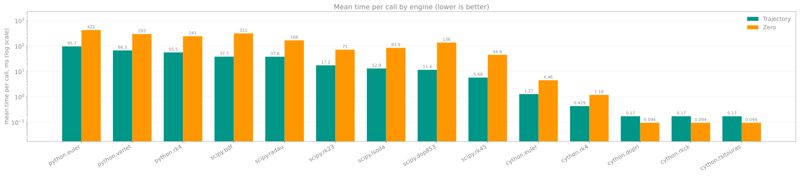
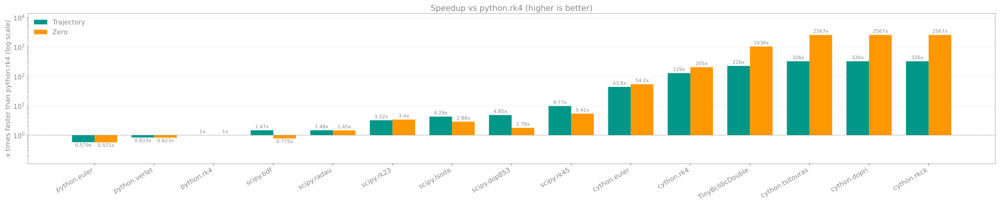

# Benchmarks

Mean time per call for each engine (lower is better), generated from
[`benchmarks/benchmarks.csv`](../../benchmarks/benchmarks.csv) by `scripts/bench_report.py`.
Each engine has two bars: `Trajectory` (fire a trajectory) and `Zero` (find the zero angle).
The vertical scales are logarithmic.

## Mean time

## Speedup vs `python.rk4`

- **Version:** `3.0.0b3.dev6+gb93f81ed6` (branch `scipy-performance-bench`, commit `b93f81e`)
- Where an engine was run several times, the run with the most repeats is used.
- Only engines present in the benchmark data are listed.

## Results

| Engine | Trajectory, ms | vs `python.rk4` | Zero, ms | vs `python.rk4` | Repeats |
|--------|---------------:|-----------:|---------:|-----------:|--------:|
| `python.euler` | 95.744 | 0.579x | 422.462 | 0.571x | 50 |
| `python.verlet` | 66.536 | 0.833x | 293.166 | 0.823x | 50 |
| `python.rk4` | 55.455 | 1x | 241.340 | 1x | 50 |
| `scipy.bdf` | 37.744 | 1.47x | 311.273 | 0.775x | 100 |
| `scipy.radau` | 37.555 | 1.48x | 166.027 | 1.45x | 500 |
| `scipy.rk23` | 17.228 | 3.22x | 71.026 | 3.4x | 500 |
| `scipy.lsoda` | 12.939 | 4.29x | 83.901 | 2.88x | 500 |
| `scipy.dop853` | 11.439 | 4.85x | 135.603 | 1.78x | 100 |
| `scipy.rk45` | 5.678 | 9.77x | 44.611 | 5.41x | 500 |
| `cython.euler` | 1.267 | 43.8x | 4.455 | 54.2x | 500 |
| `cython.rk4` | 0.429 | 129x | 1.179 | 205x | 1000 |
| `cython.dopri` | 0.170 | 326x | 0.094 | 2567x | 2000 |
| `cython.rkck` | 0.170 | 326x | 0.094 | 2567x | 2000 |
| `cython.tsitouras` | 0.170 | 326x | 0.094 | 2567x | 2000 |

!!! note
    Adaptive engines (`cython.rkck`, `cython.dopri`, `cython.tsitouras`) take far fewer steps than
    fixed-step RK4, which is why `Zero` shows such a large gap. Results depend on hardware and workload;
    treat them as relative figures. See [Engines](engines.md) for the engine overview.
