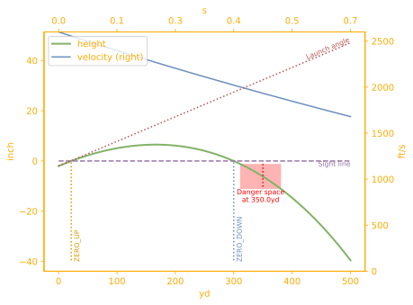

# Ballistic Concepts

## Coordinates


**Gravity gives $\boldsymbol{y}$:** In ballistics, everything is referenced to the direction of gravity. The gravity vector points "down," and this defines the vertical direction. In 3D Cartesian coordinates $(x, y, z)$ the gravity vector is $(0, -g, 0)$, where $g$ is acceleration due to gravity (typically 32 feet/second² or 9.8 meters/second²). The $y$ coordinate describes vertical (up/down) position.

**Horizontal:** Having defined the vertical axis using the gravity vector, we can then define *horizontal* as any vector perpendicular (or *orthogonal*) to the direction of gravity.

**Sight gives $\boldsymbol{x}$ axis:** The second key reference in ballistics is the **sight line**. We set the horizontal axis to the sight line, which is typically a ray from the shooter's eye through the center of a sighting device like a scope.

**Muzzle gives origin:** The origin of our 3D coordinate system `(0, 0, 0)` is the point on the sight line directly above the point that the projectile begins free flight. For a typical gun, free flight begins at the muzzle, which is vertically offset from the sight line by a `sight_height`, so the launch point is actually `(0, -sight_height, 0)`.  The following illustration shows this relationship:


**The $\boldsymbol{x}$ coordinate** measures distance from launch along a horizontal sight line.

**The $\boldsymbol{z}$ coordinate** describes position orthogonal to both the direction of gravity and the sight line. From the perspective of the sight, this is lateral position, also known as _windage_.

## Look angle

*Look angle*, a.k.a. *slant angle*, is the elevation of the sight line (a.k.a., _Line of Sight_, or _LoS_) relative to the horizon. For angles close to horizontal (_flat fire_) this does not make a significant difference. When the look angle is significantly above or below the horizon the trajectory will be different because:

1. Gravity is not orthogonal to the velocity.
2. Air density changes with altitude, so the drag effects will vary across an arcing trajectory.

The shooter typically cares about the line of sight (LoS): Sight adjustments are made relative to LoS.  Ranging errors – and hence [danger space](#danger-space) – follow the _slant-height_, not the horizontal height.

The following diagram shows how _slant distance_ and _slant height_ relate by _look angle_ to the underlying (distance $x$, height $y$) trajectory data.  [Understanding Slant Angle](https://github.com/o-murphy/py-ballisticcalc/blob/master/examples/Understanding_Slant_Angle.ipynb) covers these concepts in more detail.


## Danger Space

Danger space is a practical measure of sensitivity to ranging error. It is defined for a target of height $h$ and distance $d$, and it indicates how far forward and backward along the line of sight the target can move such that the trajectory will still hit somewhere (vertically) on the target.


### Example

```python
from py_ballisticcalc import *

# Define a standard .308 Winchester shot: G7 BC=0.22, muzzle velocity 2600fps
zero = Shot(weapon=Weapon(sight_height=Distance.Inch(2)),
			ammo=Ammo(DragModel(0.22, TableG7), mv=Velocity.FPS(2600)))

# Set a 300-yard zero
calc = Calculator()
zero_distance = Distance.Yard(300)
zero_elevation = calc.set_weapon_zero(zero, zero_distance)

# Plot the trajectory to 500 yards
result = calc.fire(zero, trajectory_range=Distance.Yard(500),
                         trajectory_step=Distance.Yard(10), flags=TrajFlag.ALL)
ax = result.plot()

# Compute and display danger space for a 10-inch target at 350 yards
danger_space = result.danger_space(Distance.Yard(350), Distance.Inch(10))
danger_space.overlay(ax)
plt.show()
print(danger_space)
```
`Danger space at 350.0yd for 10.0inch tall target ranges from 311.0yd to 381.1yd`


## Learn by Example

- [Examples notebook][Examples.ipynb]
- [Extreme Examples][ExtremeExamples.ipynb]

## API Pointers

???+ api "Selected API references"

	[`py_ballisticcalc.interface.Calculator`][py_ballisticcalc.interface.Calculator]<br>
	[`py_ballisticcalc.munition.Ammo`][py_ballisticcalc.munition.Ammo]<br>
	[`py_ballisticcalc.drag_model.DragModel`][py_ballisticcalc.drag_model.DragModel]<br>
	[`py_ballisticcalc.conditions.Atmo`][py_ballisticcalc.conditions.Atmo]<br>
	[`py_ballisticcalc.munition.Weapon`][py_ballisticcalc.munition.Weapon]<br>
	[`py_ballisticcalc.shot.Shot`][py_ballisticcalc.shot.Shot]<br>
	[`py_ballisticcalc.trajectory_data.TrajectoryData`][py_ballisticcalc.trajectory_data.TrajectoryData]<br>
	[`py_ballisticcalc.trajectory_data.HitResult`][py_ballisticcalc.trajectory_data.HitResult]<br>
	[`py_ballisticcalc.unit.Unit`][py_ballisticcalc.unit.Unit]<br>

[Examples.ipynb]:
https://github.com/o-murphy/py_ballisticcalc/blob/master/examples/Examples.ipynb

[ExtremeExamples.ipynb]:
https://github.com/o-murphy/py_ballisticcalc/blob/master/examples/ExtremeExamples.ipynb