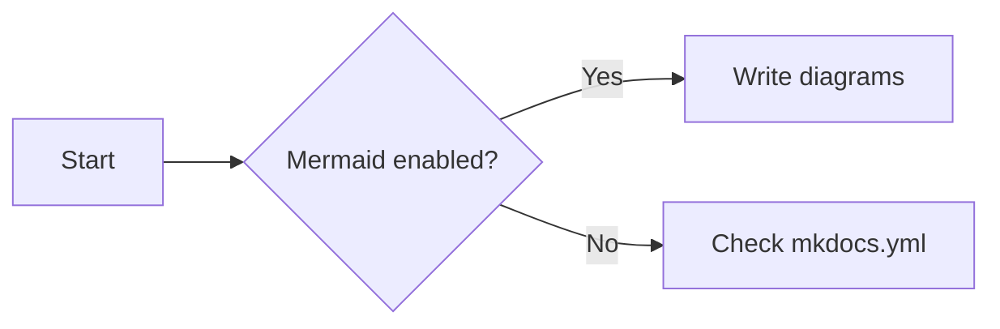

We'd love for you to contribute to py_ballisticcalc!

## Issues

Questions, feature requests and bug reports are all welcome
as [discussions or issues](https://github.com/o-murphy/py-ballisticcalc/issues/new/choose).

[//]: # (**However, to report a security vulnerability, please see our [security policy]&#40;https://github.com/o-murphy/py-ballisticcalc/security/policy&#41;.**)

To make it as simple as possible for us to help you, please include the output of the following call in your issue:

```bash
python -c "from importlib.metadata import metadata; print(metadata('py-ballisticcalc')['Version'])"
```

Please try to always include the above unless you're unable to install py-ballisticcalc or **know** it's not relevant
to your question or feature request.

## Pull Requests

It should be extremely simple to get started and create a Pull Request.
py-ballisticcalc is released regularly so you should see your improvements release in a matter of days or weeks 🚀.

Unless your change is trivial (typo, docs tweak etc.), please create an issue to discuss the change before
creating a pull request.

If you're looking for something to get your teeth into, check out the
["help wanted"](https://github.com/o-murphy/py-ballisticcalc/issues?q=is%3Aopen+is%3Aissue+label%3A%22help+wanted%22)
label on github.

To make contributing as easy and fast as possible, you'll want to run tests and linting locally. Luckily,
py-ballisticcalc has few dependencies, and tests don't need access to databases, etc.
Because of this, setting up and running the tests should be very simple.

!!! note
    For high performance, [the py-ballisticcalc.exts subproject](internals/cython.md) requires [cython](https://cython.readthedocs.io/en/latest/src/quickstart/install.html) to create compiled calculation engines.

Following are the basics of creating a Pull Request.  For more developer guidance see [Developer Details](internals/details.md) and [Architecture](internals/architecture.md).

### Prerequisites

You'll need the following prerequisites:

- Any Python version >= **Python 3.10**
- [**venv**](https://docs.python.org/3/library/venv.html) or [**uv**](https://docs.astral.sh/uv/getting-started/installation/) or other virtual environment tool
- **git**

For the Cythonized/C-based engines, you must have the following build dependencies installed:

=== "Linux"
    - **GCC** (e.g., `build-essential` for Ubuntu/Debian or `build-base` for Alpine)
    - **`python3-dev`** (or equivalent Python development headers)

=== "Windows"
    - **Microsoft Visual C++ (MSVC)** build tools

=== "macOS"
    - **Xcode Command Line Tools** (installs Clang/GCC, `make`, etc.)


### Installation and setup

Fork the repository on GitHub and clone your fork locally.

```bash
# Clone your fork and cd into the repo directory
git clone git@github.com:<your username>/py-ballisticcalc.git
cd py-ballisticcalc
```

=== "pip"
    ```bash
    # Setup virtual environment (we will use `venv` there)
    python -m venv .venv
    source .venv/bin/activate

    # Install package in editable mode with `dev` requirements to local environment 
    pip install -e .[dev]
    ```

=== "uv"
    ```bash
    # Sync project
    uv sync
    # Activate `venv`
    source .venv/bin/activate
    ```

If you want to contribute to cythonized extensions you can also install them in editable mode:

=== "pip"
    ```bash
    pip install -e ./py_ballisticcalc.exts[dev]
    ```

=== "uv"
    ```bash
    uv sync --extra exts
    ```


### Setup pre-commit hooks

After syncing the project and activating environment, it is recommended to install `pre-commit` hooks, to automate the checks and ensure that all necessary preparations, such as formatting and static analysis, are done correctly before committing

Install hooks
```bash
pre-commit install
```

Run the check manually if necessary
```bash
pre-commit run --all-files
```


### Check out a new branch and make your changes

Create a new branch for your changes.

```bash
# Checkout a new branch and make your changes
git checkout -b my-new-feature-branch
# Make your changes...
```

### Run tests and linting

Run tests and linting locally to make sure everything is working as expected.

```bash
# Run automated code linting
ruff check

# Run mypy static analysing 
mypy

# Run automated tests
pytest

# Run automated tests for specific engine
pytest --engine="cythonized_rk4_engine"  # via project.entry-points
pytest --engine="my_lib.my_engine:MyEngineClass"  # via entry point path 
```

#### Coverage
We use `pytest-cov` to get coverage reports:
```shell
pytest --cov=py_ballisticcalc --cov-report=html  # for default engine
pytest --cov=py_ballisticcalc --cov-report=html --engine="scipy_engine"  # for custom engine 
```

To get coverage of Cython, set the environment variable `CYTHON_COVERAGE = '1'`, rebuild `py_ballisticcalc.exts` (from project root: `pip install -e py_ballisticcalc.exts`), then run:

```shell
python scripts/sync_cython_sources.py
pytest --engine="cythonized_rk4_engine" --cov=py_ballisticcalc --cov=py_ballisticcalc_exts --cov-report=html
```

#### Cython extensions: safety & stress

For diagnosing low-level issues (bounds, None checks, overflows) and for opt-in long-running stress tests, use the safety and stress workflows below. Commands are shown for Windows PowerShell.

```powershell
# Rebuild Cython extensions with safety checks enabled
$env:CYTHON_SAFETY = '1'
# Optional: force Cython to regenerate C code even if sources look unchanged
$env:CYTHON_FORCE_REGEN = '1'

# Reinstall extensions in editable mode (from project root)
pip install -e ./py_ballisticcalc.exts

# Run extension test suite (stress tests excluded by default via markers)
pytest ./py_ballisticcalc.exts\tests -q

# Run only the stress tests (opt-in). These are longer and more memory-heavy.
pytest ./py_ballisticcalc.exts\tests -m stress -q

# Clear env after testing
Remove-Item Env:CYTHON_SAFETY; Remove-Item Env:CYTHON_FORCE_REGEN
```

Notes:

- Safety build toggles bounds checking, wraparound, initialization checks, None checks, disables cdivision, and adds overflow checks; it trades speed for correctness to surface bugs.
- The extension test suite enables `faulthandler` for better tracebacks on crashes.
- Stress tests are marked with `@pytest.mark.stress` and are excluded by default.

### Build Documentation

If you have made any changes affecting the documentation (including changes to function signatures, class definitions, or docstrings that will appear in the API documentation), make sure the documentation builds successfully.

We use `mkdocs-material[imaging]` to support social previews.
You can find directions on how to install the required dependencies [here](https://squidfunk.github.io/mkdocs-material/plugins/requirements/image-processing/).

=== "pip"
    ```bash
    # Install dependencies for docs building
    pip install -e .[exts,docs]
    ```

=== "uv"
    ```bash
    # Install dependencies for docs building
    uv sync --extra docs --extra exts 
    ```

* `mkdocs build` will populate a `./site` folder with HTML.
* `mkdocs serve` will build and serve the HTML via local connection.

If this isn't working due to issues with the imaging plugin, try commenting out the `social` plugin line in `mkdocs.yml`
and running `mkdocs build` again.

### Commit and push your changes

Commit your changes, push your branch to GitHub, and create a pull request.

Please follow the pull request template and fill in as much information as possible. Link to any relevant issues and
include a description of your changes.

When your pull request is ready for review, add a comment with the message "please review" and we'll take a look as soon
as we can.

## Documentation

Documentation is written in Markdown and built using [Material for MkDocs](https://squidfunk.github.io/mkdocs-material/). API documentation is build from docstrings using [mkdocstrings](https://mkdocstrings.github.io/).

In general, documentation should be written in a friendly, approachable style. It should be easy to read and understand, and should be as concise as possible while still being complete.

### Code documentation

When contributing to py-ballisticcalc, please make sure that all code is well documented. The following should be documented using properly formatted docstrings:

- Modules
- Class definitions
- Function definitions
- Module-level variables

py-ballisticcalc
uses [Google-style docstrings](https://google.github.io/styleguide/pyguide.html#38-comments-and-docstrings) formatted according to [PEP 257](https://www.python.org/dev/peps/pep-0257/) guidelines. (See [Example Google Style Python Docstrings](https://sphinxcontrib-napoleon.readthedocs.io/en/latest/example_google.html)
for further examples.)

[pydocstyle](https://www.pydocstyle.org/en/stable/index.html) is used for linting docstrings. You can run `pydocstyle ./py_ballisticcalc\` to check your docstrings.

Where this is a conflict between Google-style docstrings and pydocstyle linting, follow the pydocstyle linting hints.

Class attributes and function arguments should be documented in the format "name: description." When applicable, a return type should be documented with just a description. Types are inferred from the signature/type-hints.

* Class attributes should be documented in the class docstring.

* Instance attributes should be documented as "Args" in the `__init__` docstring.


```python
class Foo:
    """A class docstring.

    Attributes:
        bar: A description of bar. Defaults to "bar".
    """

    bar: str = 'bar'
```

```python
def bar(self, baz: int) -> str:
    """A function docstring.

    Args:
        baz: A description of `baz`.

    Returns:
        A description of the return value.
    """

    return 'bar'
```

**Code examples** are encouraged but should be kept short and simple. However, every code example should be complete, self-contained, and runnable. (If you're not sure how to do this, ask for help!) We prefer print output to naked asserts, but if you're testing something that doesn't have a useful print output, asserts are fine. Code examples should pass [doctest](https://docs.python.org/3/library/doctest.html), which you can run via `scripts\run_doctest.py`.

### Mermaid

We support Mermaid diagrams in Markdown using Material for MkDocs. Use triple backticks with the `mermaid` fence; no plugin installation is required beyond our existing theme config.



Tips:

- Keep fences as ```mermaid (no extra indentation).
- Build locally to preview:
    ```powershell
    mkdocs build
    mkdocs serve
    ```
- If a diagram renders as plain text, ensure the `mermaid` fence is exactly specified and not wrapped in another code block.
